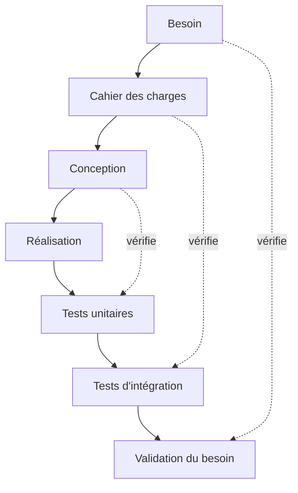
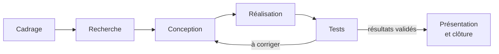

## Avant de commencer

Comment passer d'une idée à un prototype qui fonctionne et que d'autres pourront reprendre ? Cet atelier vous accompagne à chaque étape : cadrer le besoin, chercher des solutions, concevoir, réaliser, tester et présenter votre travail. Cette page donne une vue d'ensemble pour comprendre comment ces étapes s'enchaînent et vous situer dans votre projet.

## Un modèle de référence : le cycle en V

Vous avez peut-être déjà rencontré le **cycle en V** dans vos cours d'ingénierie. Son principe est simple : à chaque étape de conception correspond une étape de vérification. On précise d'abord le besoin et la manière d'y répondre, puis on réalise le système. Les tests permettent ensuite de vérifier que ce qui a été réalisé correspond à ce qui était prévu, jusqu'à valider la réponse au besoin initial.



## Les étapes de votre projet

Au MakerSpace, nous suivrons les étapes ci-dessous. Elles vous donnent un fil conducteur, avec des retours en arrière lorsque c'est nécessaire : si un test révèle un problème, vous reprenez la conception pour corriger ce qui ne fonctionne pas.

- **Cadrage** : définir le besoin et écrire le cahier des charges (voir [Définir son besoin et son cahier des charges](/workshops/methodologie-de-projet/concepts/definir-son-besoin/)).
- **Recherche** : regarder ce qui existe déjà et vérifier que les pistes envisagées sont techniquement réalisables avant de vous engager.
- **Conception** : comparer les solutions techniques et faire des essais sur des prototypes pour affiner vos choix.
- **Réalisation** : fabriquer les pièces, préparer la carte électronique, écrire le code et assembler le tout.
- **Tests** : vérifier que chaque élément, puis l'ensemble, répond aux critères de réussite fixés au cadrage.
- **Présentation et clôture** : présenter votre travail avec un poster et une vidéo, compléter la documentation et préparer la reprise du projet par une autre équipe.



## Tout au long du projet

À chaque étape, vous aurez aussi besoin de garder trois habitudes :

- **Documenter** : noter vos choix, vos essais et vos résultats au fur et à mesure, pendant que vous les avez encore en tête.
- **Organiser le travail en équipe** : répartir les tâches et faire régulièrement le point pour savoir où chacun en est et discuter des difficultés rencontrées.
- **Suivre le calendrier** : vous fixer des échéances et tenir compte des délais de commande ou de fabrication, comme l'attente pour une impression 3D.

Nous reviendrons sur chacun de ces points dans l'atelier. Ils vous aident à avancer ensemble et à laisser une trace suffisamment claire de votre travail pour qu'une autre équipe puisse le comprendre et le poursuivre.

## Exercice

Prenez quelques minutes en équipe pour faire le point sur votre projet :

1. Retrouvez votre position sur le schéma « Les étapes de votre projet ». À quelle étape êtes-vous aujourd'hui ?
2. Parmi les trois habitudes ci-dessus, laquelle avez-vous le plus de mal à tenir ? Choisissez une action concrète à mettre en place cette semaine.
