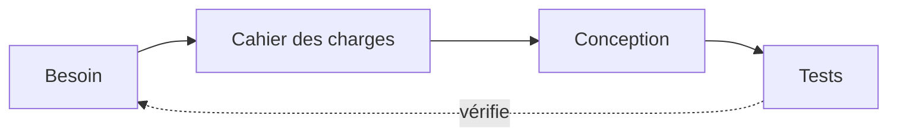

<!-- .slide: class="slide-section" data-background-color="#ef2e31" -->

## Partie 1

Du texte qui prend vie

---

## Les fragments

Chaque élément apparaît à la touche suivante, avec son propre effet :

- {: .fragment} Apparition simple
- {: .fragment .fade-up} Montée depuis le bas
- {: .fragment .fade-left} Arrivée par la gauche
- {: .fragment .grow} Un élément qui grossit
- {: .fragment .highlight-red} Mise en évidence en rouge
- {: .fragment .fade-in-then-semi-out} Visible, puis estompé

---

## Changer d'avis en direct

On documente son projet la veille du rendu au fil de l'eau.

Les classes <code>strike</code> et <code>highlight-red</code> se posent sur un simple <code>&lt;span&gt;</code>.

---

<!-- .slide: class="slide-center" -->

Documentez.

Au fil de l'eau.

---

<!-- .slide: class="slide-center" -->

1

repo par équipe, du premier commit à la soutenance
{: .fragment .fade-up}

---

<!-- .slide: class="slide-section" data-background-color="#09090b" -->

## Partie 2

Auto-Animate : les éléments se déplacent tout seuls

---

<!-- .slide: data-auto-animate -->

## Un projet, étape par étape

  
Cadrage

---

<!-- .slide: data-auto-animate -->

## Un projet, étape par étape

  
Cadrage

  →
  
Recherche

  →
  
Conception

---

<!-- .slide: data-auto-animate -->

## Un projet, étape par étape

  
Cadrage

  →
  
Recherche

  →
  
Conception

  →
  
Réalisation

  →
  
Tests

  →
  
Présentation

Les blocs qui portent le même `data-id` d'une slide à l'autre sont animés : position, taille, couleur.
{: .caption}

---

<!-- .slide: data-auto-animate class="slide-center" -->

<h2 data-id="doc-title" style="font-size: 3.4em; border: none;">Documenter</h2>

---

<!-- .slide: data-auto-animate -->

<h2 data-id="doc-title">Documenter</h2>

- Un journal de bord par personne
- Les choix techniques et leurs raisons
- Les fichiers sources dans le repo

Le titre a glissé à sa place : même `data-id`, tailles différentes.
{: .caption}

---

## Du code, ligne par ligne

<pre><code class="language-cpp" data-trim data-line-numbers="1|3-5|7-12|8-9|10-11">
const int LED = 13;

void setup() {
  pinMode(LED, OUTPUT);
}

void loop() {
  digitalWrite(LED, HIGH);
  delay(500);
  digitalWrite(LED, LOW);
  delay(500);
}
</code></pre>

Chaque appui sur → surligne le bloc suivant (`data-line-numbers`).
{: .caption}

---

<!-- .slide: class="slide-section" data-background-gradient="radial-gradient(circle at 30% 30%, #ef2e31 0%, #7f1214 45%, #09090b 100%)" -->

## Partie 3

Des fonds en plein écran

---

<!-- .slide: class="has-dark-background slide-section" data-background-image="/workshops/methodologie-de-projet/tutorials/documenter-carte-electronique/hero.jpg" data-background-color="#09090b" data-background-opacity="0.4" -->

## Une photo en fond

`data-background-image`, avec une opacité réglable pour garder le texte lisible.

Photo : carte électronique du robot Otto, MakerSpace UniLaSalle Amiens.
{: .caption}

---

<!-- .slide: class="has-dark-background" data-background-image="/workshops/methodologie-de-projet/tutorials/creer-repo-template/hero.jpg" data-background-color="#09090b" data-background-opacity="0.25" data-background-transition="zoom" -->

## Du code en toile de fond

- Le fond a sa propre transition (`data-background-transition`)
- Le texte, lui, garde la sienne

Photo : « a computer screen with a bunch of code on it » par Chris Ried, via [Unsplash](https://unsplash.com/photos/ieic5Tq8YMk), sous [licence Unsplash](https://unsplash.com/license).
{: .caption}

---

<!-- .slide: data-background-iframe="/workshops/methodologie-de-projet/" data-background-interactive -->

Une page web en fond : la page de l'atelier, en direct. Cliquez, faites défiler.

---

<!-- .slide: class="slide-section" data-background-color="#ef2e31" -->

## Partie 4

Naviguer autrement

---

## Des slides en profondeur

Cette slide a des sous-slides : descendez avec **↓**.

Pratique pour ranger des détails qu'on ne montre que si on a le temps.
{: .caption}

<!-- .down -->

## Détail 1 : un diagramme

<!-- .down -->

## Détail 2 : une formule

La loi d'Ohm, rendue par KaTeX :

$$U = R \times I$$

$$P = U \times I = R \times I^2$$
{: .fragment .fade-up}

---

## Des images empilées

  
  
  

Changes, commit, push : les captures se superposent au même endroit (`r-stack`).
{: .caption}

---

<!-- .slide: data-transition="zoom" class="slide-center" -->

## Une transition zoom

Pour une seule slide, avec `data-transition="zoom"`.

<aside class="notes" markdown="1">
Notes orateur : elles ne s'affichent que dans la vue présentateur (touche **S**), avec la slide suivante et un chronomètre.
</aside>

---

## Au clavier, pendant la séance

| Touche | Effet |
|---|---|
| **→**, **Espace** | Slide ou fragment suivant |
| **↓** | Sous-slide |
| **Échap** ou **O** | Vue d'ensemble de tout le deck |
| **S** | Vue présentateur (notes, chrono) |
| **F** | Plein écran |
| **B** ou **.** | Écran noir (pour reprendre l'attention) |
| **Alt + clic** | Zoom sur une zone de la slide |
| **G** | Aller à une slide par son numéro |

Et dans l'URL : `?view=scroll` pour lire le deck comme une page, `?print-pdf` pour l'exporter.
{: .caption}

---

<!-- .slide: class="has-dark-background slide-center" data-background-gradient="linear-gradient(135deg, #09090b 0%, #3f0d0e 55%, #ef2e31 100%)" -->

À vous de jouer.

Un fichier Markdown, `layout: slides`, et c'est parti.
