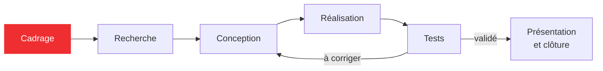

## Au programme

1. Ce qui peut mal tourner
2. Comment se passe un projet
3. Comment vous serez évalués
4. Définir son besoin
5. Documenter au fil de l'eau

<aside class="notes" markdown="1">
Déroulé : 30 min sans PC (parties 1 à 4, jusqu'à l'activité individuelle), puis 1 h avec PC.
</aside>

---

<!-- .slide: class="slide-section" -->

## Ce qui peut mal tourner

Partir de votre expérience

---

## Activité : vos pires souvenirs de projet

<p class="activity-meta"><span><i class="fas fa-users"></i>Toute la classe</span><span><i class="far fa-clock"></i>5 min</span><span><i class="fas fa-pen"></i>Sans PC</span></p>

### Qu'est-ce qui a déjà mal tourné dans un projet de groupe ?

- Une réponse par personne, à voix haute ou sur un bout de papier
- On les regroupe au tableau par famille

<aside class="notes" markdown="1">
Regrouper les réponses dans les familles de la slide suivante, puis la dévoiler.
</aside>

---

## Ce qu'on retrouve presque toujours

- **Un besoin flou** : chacun avait une idée différente du résultat
{: .fragment}
- **Une organisation floue** : personne ne savait qui faisait quoi
{: .fragment}
- **Le temps** : tout s'est fait la dernière semaine
{: .fragment}
- **La mémoire** : « pourquoi on avait choisi ça, déjà ? »
{: .fragment}
- **La technique** : un problème découvert trop tard
{: .fragment}

Chacune de ces familles a sa réponse dans ce cours.
{: .fragment .caption}

---

<!-- .slide: class="slide-section" -->

## Comment se passe un projet

Les grandes étapes, et où vous en êtes

---

## Les étapes d'un projet



**Vous êtes ici : au cadrage.** Les retours en arrière sont normaux : un test qui échoue renvoie à la conception.

[Cycle de vie d'un projet](/workshops/methodologie-de-projet/concepts/cycle-de-vie-projet/){: .doc-link}

---

## Ce que la méthode apporte

- **Cadrer** : savoir ce qu'on doit obtenir avant de choisir comment
- **S'organiser** : des rôles, des jalons, un point d'équipe à chaque séance
- **Garder la trace** : pouvoir expliquer, reprendre et présenter son travail

La technique fait avancer le projet, la méthode évite qu'il s'arrête.
{: .caption}

---

<!-- .slide: class="slide-section" -->

## Comment vous serez évalués

Grille d'évaluation et attendus

---

## Ce qui compte

<div class="columns" markdown="1">
<div markdown="1">

<p class="big-number">60 %</p>

**Individuel** : votre journal de bord et vos contributions au repo

</div>
<div markdown="1">

<p class="big-number">40 %</p>

**Groupe** : le cadrage, l'organisation et la lisibilité de la documentation

</div>
</div>

On évalue la **gestion de projet**, sur l'état de votre repo à la fin du cours. La technique est évaluée en projet.
{: .caption}

---

## Le détail

| Individuel (60 %) | Groupe (40 %) |
|---|---|
| Journal : une entrée **par séance** | Besoin et cahier des charges mesurables |
| Journal : ce qui a été fait, **pourquoi**, la suite | Rôles, issues et jalons à jour |
| Commits depuis **votre** compte, réguliers | Choix importants justifiés |
| Issues et relectures pour les autres | README et pages lisibles, template nettoyé |

La grille complète est sur la page [Évaluation du cours](/workshops/methodologie-de-projet/evaluation/) : **↓** pour la voir.
{: .caption}

<!-- .down -->

## La page Évaluation du cours

<iframe class="page-preview" data-src="/workshops/methodologie-de-projet/evaluation/#ce-qui-est-évalué" title="Page Évaluation du cours"></iframe>

Toujours en ligne : `doc.makerspace-amiens.fr/workshops/methodologie-de-projet/evaluation/`
{: .caption}

---

<!-- .slide: class="slide-section" -->

## Définir son besoin

Dire quoi, avant de dire comment

---

## Trois questions avant toute solution

1. **Pour qui ?** Qui va utiliser le résultat, et dans quelles conditions ?
2. **Pour quoi faire ?** Quel problème le projet résout-il ?
3. **Comment saura-t-on que c'est réussi ?** Avec des critères qu'on peut vérifier

On parle du **quoi**, pas du **comment** : « un moteur pas à pas » est une solution, pas un besoin.
{: .caption}

[Définir son besoin et son cahier des charges](/workshops/methodologie-de-projet/concepts/definir-son-besoin/){: .doc-link}

---

## Un critère se mesure

| Flou | Mesurable |
|---|---|
| « rapide » | en moins de 2 minutes |
| « léger » | moins de 500 g |
| « facile à utiliser » | un inconnu le démarre seul en moins de 30 s |
| « fiable » | 20 essais sur 20 sans intervention |

Question à se poser : **comment le vérifierait-on, concrètement ?**
{: .caption}

[Définir son besoin et son cahier des charges](/workshops/methodologie-de-projet/concepts/definir-son-besoin/){: .doc-link}

---

## Activité : le besoin de votre projet

<p class="activity-meta"><span><i class="fas fa-user"></i>Individuel</span><span><i class="far fa-clock"></i>7 min</span><span><i class="fas fa-pen"></i>Papier libre ou PC</span></p>

Pour **votre** projet, en une ou deux phrases chacune :

1. **Pour qui ?** Qui va utiliser le résultat, et dans quelles conditions ?
2. **Pour quoi faire ?** Quel problème le projet résout-il ?
3. **Comment saura-t-on que c'est réussi ?** Écrivez **deux critères mesurables**

Gardez vos notes : elles vous serviront tout à l'heure.
{: .caption}

<aside class="notes" markdown="1">
Fin de la partie sans PC. Les PC arrivent pendant ou juste après cette activité.
</aside>

---

## Activité : expliquez, l'autre reformule

<p class="activity-meta"><span><i class="fas fa-user-friends"></i>Binôme de projets différents</span><span><i class="far fa-clock"></i>2 × 4 min</span></p>

1. Présentez le besoin de votre projet en **1 minute**
2. Votre binôme le **reformule** en une phrase
3. Si sa reformulation est fausse, ce n'est pas lui qui a mal compris : **votre besoin n'est pas encore clair**. Corrigez-le.
4. Inversez les rôles

Quelqu'un d'extérieur au projet, c'est exactement le lecteur de votre documentation.
{: .caption}

---

## Correction : Machine That Draws

- **Pour qui ?** Les visiteurs de la Journée des Projets et le jury, puis l'équipe qui reprendra la machine
- **Pour quoi faire ?** Réaliser automatiquement un dessin sur papier à partir d'un fichier, sans intervention pendant le tracé
- **Comment saura-t-on que c'est réussi ?** Voir les critères, slides suivantes
{: .fragment}

On ne parle ni de moteurs, ni d'Arduino, ni de CAO : ce sont des solutions.
{: .fragment .caption}

---

## Correction : les fonctions principales

Ce que la machine doit **faire** :

| Fonction | Critère | Niveau attendu | Flexibilité |
|---|---|---|---|
| FP1 : tracer un dessin | Écart sur un carré de 10 cm | ≤ 1 mm par côté | F1 |
| FP2 : couvrir une feuille | Format de la zone de dessin | A4 au minimum | F1 |
| FP3 : tracer sans aide | Intervention pendant un tracé | aucune | F0 |
| FP4 : se présenter au public | Durée d'un tracé de démonstration | ≤ 5 min | F2 |
{: .table-dense}

Valeurs d'exemple : c'est à votre équipe de les fixer, puis de les écrire dans `objectifs.md`.
{: .caption}

---

## Correction : les contraintes

| Contrainte | Critère | Niveau attendu | Flex. |
|---|---|---|---|
| FC1 : utiliser la base fournie | Fixation sur plaque percée | aucun perçage supplémentaire | F0 |
| FC2 : utiliser le kit fourni | Composants hors kit | justifiés et validés | F1 |
| FC3 : fabriquer au MakerSpace | Procédés | machines et outils du lieu | F1 |
| FC4 : tenir le calendrier | Proof of Concept | fonctionnel fin du S1 | F0 |
| FC5 : sécurité du public | Pièces en mouvement | aucun pincement possible | F0 |
{: .table-dense}

Kit fourni : moteurs et électronique de commande. F0 : impératif, F3 : négociable.
{: .caption}

[Définir son besoin et son cahier des charges](/workshops/methodologie-de-projet/concepts/definir-son-besoin/){: .doc-link}

---

## Une base, pas un modèle à recopier

<p class="activity-meta"><span><i class="fas fa-exclamation-triangle"></i>Attention</span></p>

- Ces tableaux sont le **strict minimum**, pas la correction attendue
- Il manque volontairement des fonctions et des contraintes : **à vous de compléter**
- C'est à votre équipe de fixer les **niveaux minimum** et de les justifier
- Votre cahier des charges **évoluera** : notez ce qui change et pourquoi

[Définir son besoin et son cahier des charges](/workshops/methodologie-de-projet/concepts/definir-son-besoin/){: .doc-link}

---

<!-- .slide: class="slide-section" -->

## Documenter au fil de l'eau

Y compris pendant les séances de méthodologie

---

## Pourquoi maintenant, et pas à la fin

- **Dans trois semaines**, vous aurez oublié pourquoi vous avez fait ce choix
- **L'équipe qui reprendra** votre projet n'aura que ce qui est écrit
- **La soutenance et le rapport** se construisent à partir de ces traces
- **60 % de l'évaluation** repose sur votre journal et vos contributions

Écrire 10 minutes à chaque séance coûte moins cher que reconstituer un semestre la veille du rendu.
{: .caption}

[Documenter au fil de l'eau](/workshops/methodologie-de-projet/concepts/documenter-au-fil-de-leau/){: .doc-link}

---

## Le repo de votre équipe

Chaque équipe a déjà son repo, créé depuis le template :

```text
docs/
├── objectifs.md              le besoin et le cahier des charges
├── equipe.md                 les membres et les rôles
├── etudes.md                 l'existant et la faisabilité
├── conception/               mécanique, électronique, code
├── fabrication/              les étapes de fabrication
├── tests.md                  les essais et leurs résultats
└── journal/
    ├── _modele-seance.md     le modèle d'une entrée
    └── etudiant-1/           votre journal (renommable avec votre prénom)
```

[Créer son repo depuis le template](/workshops/methodologie-de-projet/tutorials/creer-repo-template/){: .doc-link} [Personnaliser le template](/workshops/methodologie-de-projet/tutorials/personnaliser-template/){: .doc-link}

---

## Une entrée de journal

Un fichier par séance, nommé avec la date : `2026-10-05.md`

```markdown
## Fait

Séance de méthodologie : besoin du projet reformulé avec un binôme.

## Pourquoi

Ma première version parlait de moteurs : c'était une solution, pas un besoin.

## Reste à faire

- Relire le besoin avec l'équipe et l'écrire dans objectifs.md
```

[Tenir un journal de bord](/workshops/methodologie-de-projet/tutorials/journal-de-bord/){: .doc-link}

---

## Photos et vidéos : à chaque séance

- **Photographiez tout** : montage, essai raté, tableau blanc, avant et après une modification
- **Filmez les essais** : 10 secondes de vidéo valent un long paragraphe
- **Cadrez en vertical** : une photo en portrait s'intègre mieux dans une page de documentation
- **Rangez et nommez** : `docs/assets/images/`, avec un nom qui dit ce qu'on voit (`essai-stylo-servo.jpg`, pas `IMG_4521.jpg`)

Une photo prise sur le moment ne se refait pas : une fois démonté, c'est trop tard.
{: .caption}

[Documenter l'assemblage et le montage](/workshops/methodologie-de-projet/tutorials/documenter-assemblage-montage/){: .doc-link}

---

## Captures et vidéos d'écran

| Action | Windows | macOS | Linux (GNOME) |
|---|---|---|---|
| Capturer une zone | <kbd>Win</kbd> <kbd>Maj</kbd> <kbd>S</kbd> | <kbd>Cmd</kbd> <kbd>Maj</kbd> <kbd>4</kbd> | <kbd>Impr. écran</kbd> |
| Filmer l'écran | <kbd>Win</kbd> <kbd>Alt</kbd> <kbd>R</kbd> | <kbd>Cmd</kbd> <kbd>Maj</kbd> <kbd>5</kbd> | <kbd>Ctrl</kbd> <kbd>Maj</kbd> <kbd>Alt</kbd> <kbd>R</kbd> |

**Sous Windows, [ShareX](https://getsharex.com/)** (libre et gratuit) fait tout en un raccourci : capture de zone, vidéo ou GIF de l'écran, flèches et annotations, copie directe dans le presse-papier.

Pour une animation, préférez une courte vidéo MP4 à un GIF : bien plus légère pour la même durée.
{: .caption}

---

## Attention au poids des fichiers

<div class="columns" markdown="1">
<div markdown="1">

<p class="big-number">2 Mo</p>

**par photo, au maximum.** Visez 500 Ko : 1600 pixels de large suffisent pour une page web.

</div>
<div markdown="1">

<p class="big-number">25 Mo</p>

**par vidéo, au maximum.** Courte, en 720p : elle reste dans le repo, avec le reste du projet.

</div>
</div>

Une page doit se charger vite, même sur un téléphone. Le repo **vérifie le poids de chaque fichier** à chaque push (onglet **Actions**) : un dépassement se voit tout de suite, et à la correction aussi.
{: .caption}

[Les règles des fichiers du repo](/workshops/methodologie-de-projet/tutorials/personnaliser-template/#les-règles-des-fichiers-du-repo){: .doc-link}

---

## Astuce : l'IA pour mettre en forme

<p class="activity-meta"><span><i class="fas fa-lightbulb"></i>Astuce</span></p>

- **Dictez** en fin de séance (note vocale, 2 minutes), ou prenez des notes en vrac
- Demandez ensuite une **remise en forme**, pas une rédaction :

```text
Voici mes notes de séance en vrac. Mets-les en forme en trois parties :
Fait, Pourquoi, Reste à faire. N'ajoute aucune information.
```

**Relisez tout** : l'IA peut se tromper ou mal interpréter vos notes. C'est votre journal qui est évalué.
{: .caption}

---

## Activité : votre première entrée de journal

<p class="activity-meta"><span><i class="fas fa-user"></i>Individuel</span><span><i class="far fa-clock"></i>20 min</span><span><i class="fas fa-laptop"></i>Sur PC</span></p>

1. Ouvrez le repo de votre équipe et récupérez les dernières modifications (**Pull**)
2. Copiez `docs/journal/_modele-seance.md` dans **votre** dossier, renommez-le avec la date du jour
3. Racontez cette séance : ce que vous avez fait, le besoin retravaillé, ce qui reste à faire
4. **Commit** avec un message clair, puis **Push**

[Tenir un journal de bord](/workshops/methodologie-de-projet/tutorials/journal-de-bord/){: .doc-link} [Git, GitHub Desktop et VSCode](/workshops/methodologie-de-projet/tutorials/git-github-desktop-vscode/){: .doc-link}

---

## Activité : relecture croisée

<p class="activity-meta"><span><i class="fas fa-user-friends"></i>Binôme de projets différents</span><span><i class="far fa-clock"></i>7 min</span><span><i class="fab fa-github"></i>Sur GitHub</span></p>

1. Ouvrez l'entrée de votre binôme **sur GitHub**
2. Sans lui poser de question : comprenez-vous ce qu'il a fait, et **pourquoi** ?
3. Donnez-lui **une** chose à préciser
4. Il corrige, commit et push

---

## D'ici la prochaine séance

<p class="activity-meta"><span><i class="fas fa-users"></i>Avec votre équipe projet</span></p>

1. Mettez vos besoins en commun dans `objectifs.md` (**Problème et public cible**)
2. Répartissez les rôles dans `equipe.md` (**responsable et backup**)
3. Commencez à **chercher l'existant** et notez vos sources dans `etudes.md` : on y revient à la prochaine séance
4. Une entrée de journal **à chaque séance**, projet comme méthodologie

[Constituer et organiser son équipe](/workshops/methodologie-de-projet/concepts/constituer-organiser-equipe/){: .doc-link} [Définir son besoin](/workshops/methodologie-de-projet/concepts/definir-son-besoin/){: .doc-link} [Rechercher l'existant](/workshops/methodologie-de-projet/concepts/rechercher-existant-faisabilite/){: .doc-link}

