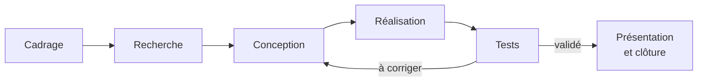

## Sommaire

1. Le projet
2. La documentation
3. L'équipe
4. Premiers pas

---

<!-- .slide: class="slide-section" -->

## Le projet

De l'idée au prototype

---

## Un projet réussi, c'est quoi ?

### Un prototype qui fonctionne, **et** un projet que d'autres peuvent reprendre

- **comprendre** : pourquoi ces choix ?
- **reproduire** : avec quels fichiers, quel matériel ?
- **reprendre** : où en est-on, que reste-t-il à faire ?
{: .fragment}

---

## Les étapes de votre projet

Des retours en arrière sont normaux : un test qui échoue renvoie à la conception.

---

## Commencer par le besoin

- À qui s'adresse le projet ?
- Quel problème résout-il ?
- Comment saurez-vous qu'il est réussi ?

> Un critère de réussite se mesure : « trier 10 objets en moins de 2 minutes » plutôt que « trier rapidement ».

---

<!-- .slide: class="slide-section" -->

## La documentation

Garder la trace, sans attendre la fin

---

## Documenter au fil de l'eau

- Noter **au moment où l'on fait**, pas la veille du rendu
- Un **journal de bord** par personne, à chaque séance
- Garder la trace des **choix techniques** et de leurs raisons
- Photos, schémas, fichiers sources : tout va dans le repo

---

## Les outils de l'atelier

| Outil | Pour quoi faire |
|---|---|
| **GitHub** | Versionner les fichiers et suivre les tâches |
| **GitHub Desktop / VS Code** | Travailler sur le repo depuis son poste |
| **Markdown** | Rédiger la documentation |
| **Site du template** | Publier la documentation du projet |

---

## Un repo par équipe, créé depuis le template

Sur la page du template, **Use this template** puis **Create a new repository**.
{: .caption}

---

## Enregistrer son travail : un commit

Dans **GitHub Desktop**
{: .caption}

Dans **VS Code**
{: .caption}

---

<!-- .slide: class="slide-section" -->

## L'équipe

Des rôles, des jalons, des points réguliers

---

## Travailler en équipe

- Des **rôles** clairs, mais une responsabilité partagée
- Des **jalons** datés pour se situer
- Un point d'équipe court à chaque séance : fait, à faire, bloquant

---

<!-- .slide: class="slide-section" -->

## Premiers pas

Ce qu'on fait dès aujourd'hui

---

## Pour la première séance

1. Créer le repo de l'équipe à partir du template
2. Installer GitHub Desktop et VS Code
3. Rédiger ensemble une première version du besoin

Tout est détaillé dans l'atelier : [doc.makerspace-amiens.fr/workshops/methodologie-de-projet](/workshops/methodologie-de-projet/)
