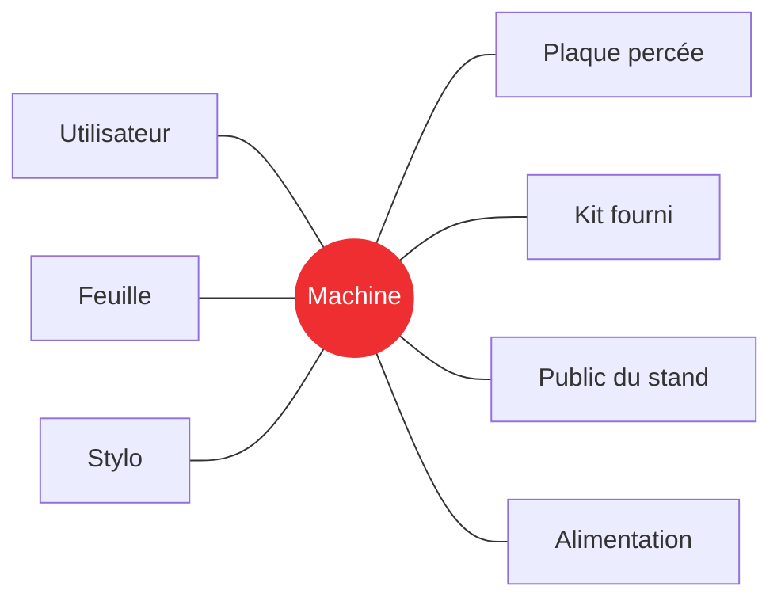

## Au programme

1. Où en êtes-vous ?
2. Le cahier des charges complet
3. Rechercher l'existant
4. Garder la trace

<aside class="notes" markdown="1">
Déroulé (1 h 30, avec PC) : retour sur la consigne 10 min, cahier des charges 30 min, existant 37 min, journal et consigne 13 min.
</aside>

---

## Activité : où en êtes-vous ?

<i class="fas fa-user-friends"></i>Binôme de projets différents<i class="far fa-clock"></i>10 min<i class="fab fa-github"></i>Sur GitHub

Ouvrez le repo de **votre** équipe et montrez à votre binôme :

1. `objectifs.md` : lisez le besoin **sans l'expliquer**. Votre binôme le comprend-il ?
2. `equipe.md` : chaque rôle a-t-il un responsable **et** un backup ?
3. Votre journal : une entrée pour la séance 1, et pour chaque séance de projet depuis ?

Notez ce qui manque : vous le compléterez pendant la séance.
{: .caption}

---

<!-- .slide: class="slide-section" -->

## Le cahier des charges complet

Tout ce que la machine doit faire, et tout ce qu'elle doit respecter

---

## Rappel : fonctions et contraintes

| | Fonction principale (FP) | Fonction contrainte (FC) |
|---|---|---|
| **Répond à** | Que doit **faire** la machine ? | À quoi doit-elle **s'adapter** ? |
| **Exemple** | Tracer un dessin | Utiliser la plaque percée fournie |
| **Critère** | Écart sur un carré de 10 cm | Perçages supplémentaires |
| **Niveau** | ≤ 1 mm par côté | aucun |

Chaque ligne a aussi une **flexibilité** : de F0 (impératif) à F3 (négociable).
{: .caption}

[Le tableau des fonctions](/workshops/methodologie-de-projet/concepts/definir-son-besoin/#le-tableau-des-fonctions--rendre-chaque-fonction-mesurable){: .doc-link}

---

## Trouver les fonctions qui manquent

Pour chaque élément autour : **que doit faire la machine avec lui, ou respecter à cause de lui ?** Chaque réponse est une fonction de plus.
{: .caption}

[Le diagramme pieuvre](/workshops/methodologie-de-projet/concepts/definir-son-besoin/#le-diagramme-pieuvre--lister-les-fonctions-à-assurer){: .doc-link}

---

## Et pour fixer les niveaux ?

- **Mesurez** : la taille de la feuille, la place sur une table, la course d'un servo
- **Regardez l'existant** : ce que d'autres machines atteignent vraiment
- **Partez des contraintes** : le calendrier et le kit fournis limitent ce qui est réaliste
- **Assumez la flexibilité** : un niveau incertain peut être F2, à revoir après les premiers essais

Un niveau inventé « pour remplir la case » ne sert à rien : il faut pouvoir dire d'où il vient.
{: .caption}

---

## Activité : complétez votre cahier des charges

<i class="fas fa-user"></i>Individuel<i class="far fa-clock"></i>20 min<i class="fas fa-laptop"></i>Sur PC

1. **Pull** avant tout : vos coéquipiers modifient le même fichier
2. Dans `objectifs.md`, ajoutez **au moins deux** fonctions ou contraintes, avec critère, niveau et flexibilité
3. Pour chaque niveau, sachez dire **d'où il vient**
4. **Commit** et **Push** tout de suite, pour limiter les conflits

Si le Push est refusé, faites un Pull puis recommencez : Git fusionne seul tant que vous n'avez pas modifié la même ligne.
{: .caption}

[Git, GitHub Desktop et VSCode](/workshops/methodologie-de-projet/tutorials/git-github-desktop-vscode/){: .doc-link}

---

<!-- .slide: class="slide-section" -->

## Rechercher l'existant

Ne pas réinventer, et apprendre des erreurs des autres

---

## Pourquoi chercher avant de concevoir

- **Gagner du temps** : quelqu'un a sûrement déjà résolu une partie de votre problème
- **Fixer des niveaux réalistes** : ce que d'autres machines atteignent vraiment
- **Éviter les pièges** : les problèmes rencontrés par les autres sont souvent documentés
- **Justifier vos choix** : « on a comparé trois solutions » vaut mieux que « c'était la première idée »

L'an dernier, moins de la moitié des équipes Machine That Draws ont documenté leur recherche de l'existant.
{: .caption}

[Rechercher l'existant et étudier la faisabilité](/workshops/methodologie-de-projet/concepts/rechercher-existant-faisabilite/){: .doc-link}

---

## Où chercher

- **Les projets des années précédentes** : repos et documentations sur [makerspace-amiens.fr/makerspace-projects](https://makerspace-amiens.fr/makerspace-projects/)
- **Les projets en ligne** : Hackaday, Instructables, GitHub, Printables
- **Les produits du commerce** : leurs fiches techniques donnent des niveaux de performance
- **Les vidéos** : pour voir une machine fonctionner, et ses défauts

Cherchez aussi **ce qui n'a pas marché** : un échec documenté vous évite de le reproduire.
{: .caption}

---

## Chercher aussi par sous-système

Ne cherchez pas que des « machines qui dessinent » : découpez votre machine en fonctions, et cherchez **qui a déjà résolu chacune**.

| Sous-système | Où trouver des idées |
|---|---|
| Déplacer un outil en X et Y | Imprimantes 3D, fraiseuses CNC, découpeuses laser |
| Lever et poser le stylo | Servomoteurs, solénoïdes, cames |
| Tenir la feuille à plat | Pinces, aimants, adhésif repositionnable, plateau aspirant |
| Se fixer sur la plaque percée | Jeux de construction à trous, profilés |
| Transformer une image en tracé | Logiciels de vectorisation, génération de G-code |
{: .table-dense}

On reprendra cette démarche à la prochaine séance, pour **choisir les solutions techniques** de chaque sous-système.
{: .caption}

[Rechercher l'existant et étudier la faisabilité](/workshops/methodologie-de-projet/concepts/rechercher-existant-faisabilite/){: .doc-link}

---

## Quoi en retenir : une fiche par solution

| Solution étudiée | Source | Avantages | Inconvénients | Ce qu'on retient |
|---|---|---|---|---|
| Nom de la machine ou du projet | Lien cliquable | Ce qui marche bien | Ce qui pose problème | Ce qu'on garde, teste ou **écarte, et pourquoi** |

La dernière colonne est la plus importante : c'est elle qui relie l'existant à **votre** projet.
{: .caption}

[Comment présenter sa recherche](/workshops/methodologie-de-projet/concepts/rechercher-existant-faisabilite/#comment-présenter-ça){: .doc-link}

---

## Un extrait réel : qu'est-ce qui manque ?

> **Système core XY** : variation sophistiquée des machines cartésiennes, utilisant deux moteurs pour déplacer la tête de dessin simultanément sur les axes X et Y.
>
> **Avantages** : permet un mouvement plus rapide et fluide, tout en réduisant les vibrations.
>
> **Inconvénients** :

- **Aucune source** : d'où vient cette information ?
{: .fragment}
- **Des inconvénients vides** : l'analyse s'arrête à mi-chemin
{: .fragment}
- **Aucune décision** : est-ce retenu ou écarté, et pourquoi ?
{: .fragment}

Extrait d'un repo Machine That Draws de l'an dernier, anonymisé.
{: .caption}

---

## Exemple : trois solutions étudiées

| Solution étudiée | Source | Avantages | Inconvénients | Ce qu'on retient |
|---|---|---|---|---|
| AxiDraw | [axidraw.com](https://axidraw.com/) | Précis, zone A4 | Produit du commerce | Stylo posé par son poids : à reprendre |
| Polargraph | [GitHub](https://github.com/euphy/polargraph) | Grande surface, deux moteurs | Surface verticale | Écarté : incompatible avec FC1 |
| Machine That Draws 2025-26, groupe 08 | [Repo](https://github.com/Makerspace-Amiens-2025-26/MachineThatDraws-Groupe08) | Arduino, CNC Shield et GRBL : ça a marché | Moteurs qui vibraient (drivers mal réglés) | À tester en premier |
{: .table-dense}

Chaque ligne se termine par une **décision** reliée au cahier des charges.
{: .caption}

---

## Activité : votre fiche de l'existant

<i class="fas fa-user"></i>Individuel<i class="far fa-clock"></i>25 min<i class="fas fa-laptop"></i>Sur PC

1. **Pull**, puis ouvrez `etudes.md`, section **Recherche de l'existant**
2. Ajoutez **deux lignes** au tableau : une autre **machine qui dessine** (un projet de l'an dernier, par exemple), et une solution trouvée ailleurs pour **une partie** de votre machine (lever le stylo, tenir la feuille…)
3. Remplissez **toutes** les colonnes, avec une source cliquable
4. **Commit** et **Push**
5. Votre binôme relit : la source s'ouvre-t-elle ? Comprend-il ce que vous en retenez ?

Entre coéquipiers : une ligne par solution, et un Pull juste avant d'écrire.
{: .caption}

---

<!-- .slide: class="slide-section" -->

## Garder la trace

Le journal, à chaque séance

---

## Activité : le journal de la séance

<i class="fas fa-user"></i>Individuel<i class="far fa-clock"></i>8 min<i class="fas fa-laptop"></i>Sur PC

Une nouvelle entrée datée dans votre dossier :

- **Fait** : les fonctions ajoutées au cahier des charges, les solutions étudiées
- **Pourquoi** : d'où viennent vos niveaux, pourquoi vous écartez une solution
- **Reste à faire** : ce que l'équipe doit encore trancher

Une capture de votre tableau ou de la machine étudiée rend l'entrée plus parlante.
{: .caption}

[Tenir un journal de bord](/workshops/methodologie-de-projet/tutorials/journal-de-bord/){: .doc-link}

---

## D'ici la prochaine séance

<i class="fas fa-users"></i>Avec votre équipe projet

1. Relisez ensemble le cahier des charges et **mettez-vous d'accord** sur les niveaux
2. Mettez en commun l'existant et listez les **grandes parties** de votre machine
3. Une entrée de journal **à chaque séance**, projet comme méthodologie

La prochaine séance : découper la machine en sous-systèmes, et organiser le travail avec un GitHub Project.
{: .caption}

[Rechercher l'existant et étudier la faisabilité](/workshops/methodologie-de-projet/concepts/rechercher-existant-faisabilite/){: .doc-link} [Gérer son projet avec GitHub](/workshops/methodologie-de-projet/tutorials/gerer-projet-github/){: .doc-link}
