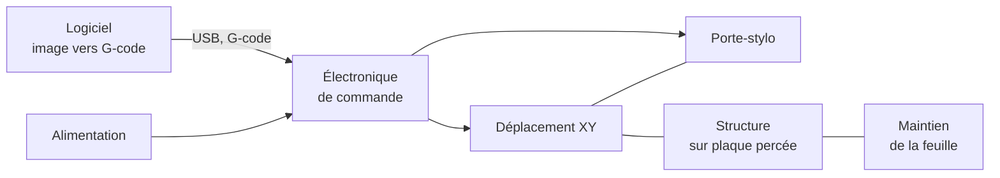

## Au programme

1. Découper la machine en sous-systèmes
2. S'organiser avec GitHub
3. Garder la trace

<aside class="notes" markdown="1">
Déroulé (1 h 30, avec PC) : retour sur la consigne 5 min, découpage 33 min, organisation GitHub 37 min, journal et consigne 13 min.
</aside>

---

## Où en êtes-vous ?

- Le cahier des charges : les niveaux sont-ils **validés par toute l'équipe** ?
- L'existant : `etudes.md` contient-il des solutions **avec leurs sources** ?
- Les grandes parties de la machine : en avez-vous parlé ensemble ?

Ce qui manque se rattrape aujourd'hui : c'est justement le point de départ du découpage.
{: .caption}

---

<!-- .slide: class="slide-section" -->

## Découper la machine

Un gros problème, c'est plusieurs petits problèmes

---

## Pourquoi découper

- **Répartir le travail** : un sous-système, un responsable
- **Chercher des solutions** partie par partie, pas pour toute la machine d'un coup
- **Tester séparément** : on valide le porte-stylo avant d'avoir le reste
- **Documenter clairement** : une page par sous-système dans `conception/`

Le template le prévoit déjà : `conception/index.md` commence par l'**architecture globale**, et les rôles de `equipe.md` peuvent suivre ce découpage.
{: .caption}

[Constituer et organiser son équipe](/workshops/methodologie-de-projet/concepts/constituer-organiser-equipe/){: .doc-link}

---

## Comment découper

1. **Partez des fonctions** du cahier des charges : chacune est assurée par une partie de la machine
2. **Regroupez** ce qui travaille ensemble : 4 à 7 sous-systèmes, pas 20
3. **Tracez les liens** : qui alimente quoi, qui commande quoi, qui est fixé sur quoi
4. **Repérez les interfaces** : là où deux sous-systèmes se touchent

Une interface oubliée, c'est deux pièces qui ne s'assemblent pas le jour du montage.
{: .caption}

---

## Activité : découpez votre machine

<i class="fas fa-user"></i>Individuel<i class="far fa-clock"></i>12 min<i class="fas fa-pen"></i>Papier ou PC

1. Listez les **sous-systèmes** de votre machine, avec la fonction que chacun assure
2. Dessinez un **schéma bloc** : une boîte par sous-système, une flèche par lien
3. Entourez les **interfaces** : fixation, connecteur, format de fichier…

Puis, en **binôme de projets différents** (6 min) : expliquez votre schéma. Votre binôme voit-il une partie oubliée ?
{: .caption}

---

## Correction : Machine That Draws

Six sous-systèmes, dont deux qu'on oublie souvent : le **logiciel** qui prépare le tracé, et le **maintien de la feuille**.
{: .caption}

---

## Correction : les interfaces à ne pas oublier

| Interface | Entre | À fixer ensemble |
|---|---|---|
| Fixation du stylo | Porte-stylo et déplacement XY | Encombrement, points de fixation |
| Fixation au châssis | Structure et plaque percée | Entraxe des trous, visserie |
| Format du tracé | Logiciel et électronique | G-code accepté par le firmware |
| Alimentation | Alimentation et électronique | Tension, courant, connecteur |

Chaque interface a **un responsable** : sinon, chacun pense que c'est l'autre.
{: .caption}

---

<!-- .slide: class="slide-section" -->

## S'organiser avec GitHub

Qui fait quoi, pour quand

---

## Le vocabulaire

| Mot | C'est… | Exemple |
|---|---|---|
| **Issue** | Une tâche, un bug ou une question à trancher | « Tester la levée du stylo par servo » |
| **Assignee** | La personne qui s'en charge | Vous |
| **Label** | Une étiquette pour trier | `porte-stylo`, `logiciel` |
| **Milestone** | Un jalon daté qui regroupe des issues | « POC fonctionnel », fin du S1 |
| **Project** | Le tableau qui affiche les issues par avancement | À faire, En cours, Terminé |
{: .table-dense}

Optionnel dans le template, mais **évalué** dans ce cours.
{: .caption}

[Gérer son projet avec GitHub](/workshops/methodologie-de-projet/tutorials/gerer-projet-github/){: .doc-link}

---

## Une issue qu'on peut vraiment traiter

**❌ Vague**

**Titre** : Problème moteur

**Description** : (vide)

**✅ Exploitable**

**Titre** : Le moteur pas à pas ne tourne pas avec le driver A4988

**Description** : le moteur reste bloqué, le driver chauffe. Câblage vérifié. Piste : réglage du courant. **Fini quand** le moteur fait 10 tours sans décrocher.

Un titre précis, le contexte, et **comment on sait que c'est fini**.
{: .caption}

---

## Un tableau par sous-système

| À faire | En cours | Terminé |
|---|---|---|
| `porte-stylo` Tester la levée par servo | `déplacement-xy` Comparer courroie et tige filetée | `structure` Relever l'entraxe des trous de la plaque |
| `logiciel` Générer un carré en G-code | `électronique` Régler le courant des drivers | |
| `feuille` Essayer le maintien par aimants | | |

Une **étiquette par sous-système**, **une personne** par issue, et un tableau qui **reflète la réalité** : une carte « En cours » depuis trois semaines, ça se discute en équipe.
{: .caption}

---

## Les jalons : des dates, pas des intentions

- Un **jalon** (milestone) est une étape datée : on sait ce qui doit être fini à cette date
- Chaque issue est rattachée à un jalon, et GitHub affiche le **pourcentage terminé**
- Exemples : « Architecture validée », « Premier trait tracé », « POC fonctionnel » (fin du S1)
- Dans le repo : onglet **Issues**, bouton **Milestones**, puis **New milestone**

Un jalon qui glisse n'est pas une faute : c'est une information, à écrire dans le journal avec sa raison.
{: .caption}

[Gérer le temps et les jalons](/workshops/methodologie-de-projet/concepts/gerer-temps-jalons/){: .doc-link}

---

## Activité : vos premières issues

<i class="fas fa-user"></i>Individuel<i class="far fa-clock"></i>25 min<i class="fab fa-github"></i>Sur GitHub

1. Onglet **Projects** du repo : si le tableau de l'équipe n'existe pas, créez-le (**New project**, modèle **Board**)
2. Onglet **Issues**, bouton **Labels** : l'étiquette de votre sous-système existe-t-elle ? Sinon, créez-la
3. Créez **trois issues** pour votre partie : titre précis, description, **fini quand**, étiquette, assignée à vous
4. Ajoutez-les au Project
5. Votre binôme relit une issue : sait-il quoi faire, et quand c'est fini ?

[Gérer son projet avec GitHub](/workshops/methodologie-de-projet/tutorials/gerer-projet-github/){: .doc-link}

---

<!-- .slide: class="slide-section" -->

## Garder la trace

Le journal, à chaque séance

---

## Activité : le journal de la séance

<i class="fas fa-user"></i>Individuel<i class="far fa-clock"></i>8 min<i class="fas fa-laptop"></i>Sur PC

- **Fait** : votre découpage de la machine, vos premières issues
- **Pourquoi** : les regroupements que vous avez choisis, les interfaces repérées
- **Reste à faire** : ce que l'équipe doit trancher ensemble

Ajoutez une photo ou une capture de votre schéma bloc : c'est la base de l'architecture globale.
{: .caption}

[Tenir un journal de bord](/workshops/methodologie-de-projet/tutorials/journal-de-bord/){: .doc-link}

---

## D'ici la prochaine séance

<i class="fas fa-users"></i>Avec votre équipe projet

1. Mettez en commun vos découpages dans `conception/index.md`, section **Architecture globale**
2. Dans `equipe.md`, un **responsable** par sous-système, et un responsable par interface
3. Créez les **jalons**, dont le POC de fin de S1, et rattachez-y les issues
4. Au début de chaque séance de projet, passez le tableau en revue ensemble

La prochaine séance : choisir les solutions de chaque sous-système, et tracer ses choix.
{: .caption}

[Tracer ses choix techniques](/workshops/methodologie-de-projet/concepts/tracer-choix-techniques/){: .doc-link} [Communiquer en équipe](/workshops/methodologie-de-projet/concepts/communiquer-en-equipe/){: .doc-link}
