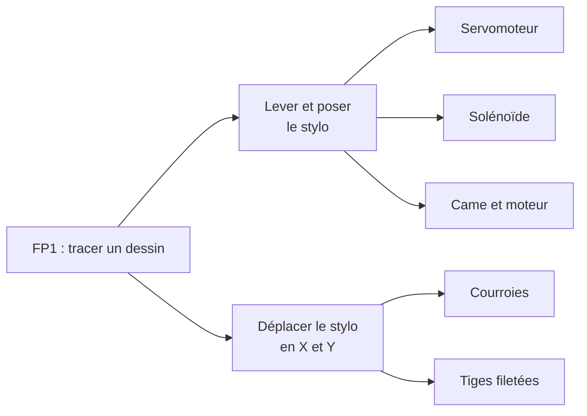

## Au programme

1. Choisir une solution par sous-système
2. Tracer ses choix
3. Documenter la conception
4. Garder la trace

<aside class="notes" markdown="1">
Déroulé (1 h 30, avec PC) : retour sur la consigne 5 min, choisir 32 min, tracer 28 min, conception 8 min, journal et consigne 13 min.
</aside>

---

## Où en êtes-vous ?

- `conception/index.md` : l'**architecture globale** est-elle écrite, avec son schéma ?
- `equipe.md` : chaque sous-système a-t-il un **responsable** ?
- Le **tableau** : des issues assignées, rattachées à un jalon ?

Le découpage de la dernière séance est le point de départ d'aujourd'hui : on choisit **sous-système par sous-système**.
{: .caption}

---

<!-- .slide: class="slide-section" -->

## Choisir une solution

Une décision argumentée, pas la première idée

---

## De la fonction aux solutions possibles



Diagramme **FAST** : au moins **deux options** par sous-système, sinon ce n'est pas un choix.
{: .caption}

[Le diagramme FAST](/workshops/methodologie-de-projet/concepts/tracer-choix-techniques/#des-fonctions-aux-solutions--le-diagramme-fast){: .doc-link}

---

## Comparer avec les critères du cahier des charges

| Critère | Servomoteur | Solénoïde | Came et moteur |
|---|---|---|---|
| Piloté par l'électronique prévue | ✅ GRBL-Servo | ⚠️ sortie à adapter | ⚠️ un moteur de plus |
| Pose douce du stylo (qualité du trait) | ✅ réglable | ❌ pose brutale | ✅ |
| Réalisable avant le POC (FC4) | ✅ | ⚠️ alimentation à ajouter | ❌ pièce à concevoir |
| **Décision** | **Retenu** | Écarté | Écarté |
{: .table-dense}

Les critères viennent du **cahier des charges**, pas du goût de chacun. Exemple pour le porte-stylo, à adapter à votre machine.
{: .caption}

---

## Et quand on hésite : un test rapide

- **Testez seulement ce qui fait douter** : le porte-stylo seul, pas toute la machine
- **Imprimez ou découpez juste l'interface** : la partie qui touche le moteur, pas la pièce entière
- **Décidez à l'avance** ce qui validera l'option : « 20 levées sans raté »
- **Notez le résultat**, même raté : c'est un argument pour le choix

La v1 brute qui fonctionne bat la v1 parfaite qui n'existe pas encore.
{: .caption}

[Prototyper et itérer](/workshops/methodologie-de-projet/concepts/prototyper-iterer/){: .doc-link}

---

## Activité : comparez les options de votre sous-système

<p class="activity-meta"><span><i class="fas fa-user"></i>Individuel</span><span><i class="far fa-clock"></i>20 min</span><span><i class="fas fa-laptop"></i>Sur PC</span></p>

Pour **le sous-système dont vous êtes responsable** :

1. Listez **deux ou trois options** (reprenez votre recherche de l'existant)
2. Choisissez **trois critères** dans le cahier des charges
3. Faites le tableau de comparaison
4. Concluez : **une décision**, ou **le test rapide** qui permettra de trancher

Gardez ce tableau : il sert tout de suite à rédiger votre choix.
{: .caption}

---

<!-- .slide: class="slide-section" -->

## Tracer ses choix

Pour ne pas refaire le même débat dans trois semaines

---

## Quatre questions par choix

**Contexte** : quel problème fallait-il résoudre, avec quelle contrainte ?
{: .fragment}

**Options envisagées** : les solutions comparées
{: .fragment}

**Choix retenu et pourquoi** : la décision et ses **arguments techniques** (tests, cahier des charges)
{: .fragment}

**Compromis acceptés** : ce qu'on perd, en connaissance de cause
{: .fragment}

Réservez ce format aux choix **coûteux à défaire** : composant central, architecture, procédé de fabrication.
{: .caption .fragment}

[Un format simple pour documenter un arbitrage](/workshops/methodologie-de-projet/concepts/tracer-choix-techniques/#un-format-simple-pour-documenter-un-arbitrage){: .doc-link}

---

## Exemple : le porte-stylo

```markdown
### Choix : servomoteur pour lever le stylo

**Contexte :** le stylo doit se lever entre deux traits, sans
intervention pendant le tracé (FP3).

**Options envisagées :** servomoteur, solénoïde, came et moteur.

**Choix retenu et pourquoi :** servomoteur. Il se pilote avec
GRBL-Servo, déjà utilisé l'an dernier (groupe 08), et il pose le
stylo en douceur. À valider : 20 levées sans raté.

**Compromis acceptés :** plus lent qu'un solénoïde, acceptable
pour une démonstration.
```

---

## Activité : rédigez votre choix

<p class="activity-meta"><span><i class="fas fa-user"></i>Individuel</span><span><i class="far fa-clock"></i>15 min</span><span><i class="fas fa-laptop"></i>Sur PC</span></p>

1. **Pull**, puis ouvrez `etudes.md`, section **Choix techniques**
2. Ajoutez **votre** choix sous un titre `### Choix : …`, avec les quatre questions
3. Collez votre tableau de comparaison juste en dessous
4. **Commit** et **Push**

Puis, en **binôme de projets différents** (5 min) : votre binôme comprend-il **pourquoi**, sans vous poser de question ?
{: .caption}

---

<!-- .slide: class="slide-section" -->

## Documenter la conception

Une page par sous-système

---

## La page de votre sous-système

Dans `conception/`, dupliquez une page d'exemple du template et renommez-la avec votre sous-système :

| Section | Ce qu'on y met |
|---|---|
| **Rôle** | À quoi il sert, quelles fonctions du cahier des charges il assure |
| **Conception** | Le choix retenu (lien vers `etudes.md`), plans ou schémas, **itérations** : ce qui n'a pas marché et ce qui a changé |
| **Fabrication** | Procédé, réglages, fichiers sources dans `project/` |

Photos de chaque version, même ratée : c'est la trace des itérations.
{: .caption}

[Documenter un système mécanique](/workshops/methodologie-de-projet/tutorials/documenter-systeme-mecanique/){: .doc-link} [Documenter une carte électronique](/workshops/methodologie-de-projet/tutorials/documenter-carte-electronique/){: .doc-link} [Documenter son code](/workshops/methodologie-de-projet/tutorials/documenter-code-firmware/){: .doc-link}

---

<!-- .slide: class="slide-section" -->

## Garder la trace

Le journal, à chaque séance

---

## Activité : le journal de la séance

<p class="activity-meta"><span><i class="fas fa-user"></i>Individuel</span><span><i class="far fa-clock"></i>8 min</span><span><i class="fas fa-laptop"></i>Sur PC</span></p>

- **Fait** : les options comparées, le choix rédigé
- **Pourquoi** : les critères qui ont fait pencher la décision
- **Reste à faire** : le test rapide à mener, la page de conception à créer

[Tenir un journal de bord](/workshops/methodologie-de-projet/tutorials/journal-de-bord/){: .doc-link}

---

## D'ici la prochaine séance

<p class="activity-meta"><span><i class="fas fa-users"></i>Avec votre équipe projet</span></p>

1. Relisez ensemble les choix de chacun : l'équipe est-elle **d'accord sur les raisons** ?
2. Créez la **page de chaque sous-système** dans `conception/`, avec au moins la section Rôle
3. Transformez les tests rapides en **issues**, rattachées à un jalon
4. Parcourez la [grille d'évaluation](/workshops/methodologie-de-projet/evaluation/) : que manque-t-il ?

La prochaine séance : revue croisée de vos repos, avec la grille d'évaluation.
{: .caption}

[Tracer ses choix techniques](/workshops/methodologie-de-projet/concepts/tracer-choix-techniques/){: .doc-link} [Checklist de clôture](/workshops/methodologie-de-projet/tutorials/checklist-cloture-projet/){: .doc-link}
