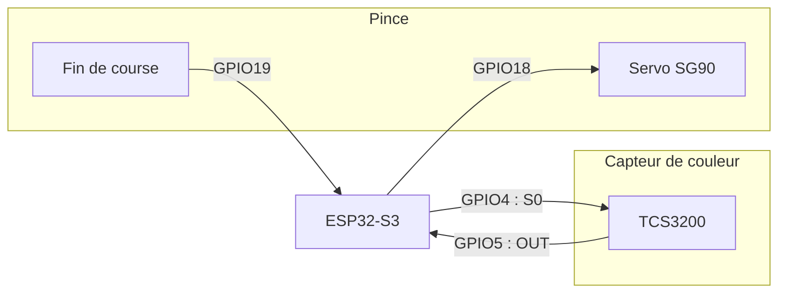



## Ce qu'il faut documenter

Une carte électronique bien documentée répond à quatre questions : à quoi
sert chaque partie du circuit, quels composants exactement, comment c'est
câblé, et pourquoi ces choix. Ce dernier point rejoint
[Tracer ses choix techniques](/workshops/methodologie-de-projet/concepts/tracer-choix-techniques/).

## Où ranger les fichiers

Deux emplacements, deux rôles :

| Emplacement | Contenu | Rôle |
|---|---|---|
| `project/ecad/<nom-de-la-carte>/` | Le projet KiCad complet (`.kicad_pro`, `.kicad_sch`, `.kicad_pcb`) | Les **sources** : c'est là que vous travaillez |
| `docs/assets/kicad/` | Une **copie** des fichiers `.kicad_sch` et `.kicad_pcb` | Ce que le **site affiche** |

Le site n'affiche que ce qui se trouve dans le dossier `docs/`. Recopiez vos
fichiers dans `docs/assets/kicad/` à chaque évolution importante de la
carte, sinon le site montre une ancienne version. Complétez aussi le
`README.md` de `project/ecad/` (un tableau : carte, dossier, rôle).

## Afficher le schéma et le PCB

Le dossier `docs/conception/electronique/` contient la page d'exemple `carte-principale.md`. Copiez-la dans le même dossier, nommez la copie d'après votre carte (par exemple `carte-capteurs.md`), puis changez son `title` et son `nav_order`. Son `parent` (« Électronique ») et son `grand_parent` (« Conception ») restent identiques. Voir [Personnaliser le template de son projet](/workshops/methodologie-de-projet/tutorials/personnaliser-template/) pour le fonctionnement du menu.




Dans votre page, remplacez les deux lignes d'exemple. Le chemin se donne **depuis le dossier `docs/`** :

```liquid

```

```liquid

```

Deux options : `controles="full"` ajoute une barre latérale avec la liste des composants, et `hauteur="700px"` agrandit la zone d'affichage (500 px par défaut).






## Méthode de secours : exporter une image

Si votre carte n'est pas faite sous KiCad, ou si vous voulez une figure
figée (pour un poster, par exemple), exportez une image. C'est la méthode
qui marche toujours, sans rien installer de plus.







Le fichier `.svg` doit se trouver dans `docs/assets/images/`. Puis, dans votre page (ici une page à deux niveaux de dossier, comme `docs/conception/electronique/carte-capteurs.md`) :

```markdown

```

Le nombre de `../` dépend de la profondeur de la page : une page directement dans `docs/` n'en a pas besoin (`assets/images/schema.svg`), une page dans `docs/fabrication/` en a un (`../assets/images/schema.svg`).


## La nomenclature (BOM)

La nomenclature liste chaque composant du circuit. Elle se génère avec KiCad,
pas à la main.

{% include step-tuto.html
  greyBackground=true
  title="Générer la nomenclature depuis KiCad"
  content="Dans l'éditeur de schéma (Eeschema), menu **Outils > Générer une nomenclature...** (*Tools > Generate Bill of Materials...*, le libellé exact varie légèrement selon la version de KiCad). Choisissez un format de sortie (CSV fonctionne partout), un dossier, puis lancez la génération. Vous obtenez un fichier listant automatiquement chaque référence, valeur et quantité de votre schéma : pas besoin de les retaper à la main." %}

Une fois le CSV généré, reformatez les colonnes utiles en tableau Markdown
pour l'intégrer proprement à votre page (référence exacte, pas juste "une
résistance"). C'est le tableau que contient la page d'exemple du template :

| Référence | Composant | Valeur / réf. exacte | Quantité | Source |
|---|---|---|---|---|
| U1 | Microcontrôleur | ESP32-S3-DevKitC-1 | 1 | ... |
| R1-R4 | Résistance | 10kΩ, 1/4W | 4 | ... |
| D1 | Driver moteur | A4988 | 1 | ... |


{% include message.html title="Le CSV brut fonctionne aussi, mais pas n'importe où" message="Si reformater à la main prend trop de temps, déposez le fichier `.csv` généré dans `docs/assets/data/` et faites-y un lien direct (moins joli qu'un tableau, mais toujours exact). Attention : le `.gitignore` du template ignore les fichiers `.csv` et `.xml` partout **sauf dans `docs/`**. Une nomenclature exportée dans `project/ecad/` n'apparaîtra donc pas dans GitHub Desktop et ne sera jamais envoyée sur GitHub." status="is-warning" icon="fas fa-exclamation-triangle" %}

### Pour aller plus loin : nomenclature interactive avec un plugin KiCad



Le plugin **[InteractiveHtmlBom](https://github.com/openscopeproject/InteractiveHtmlBom)**
génère un fichier HTML autonome qui affiche le PCB **et** la nomenclature
côte à côte : cliquez une ligne de la BOM, le composant correspondant
s'illumine sur le circuit. Particulièrement utile pour le soudage manuel
et pour [Documenter l'assemblage et le montage](/workshops/methodologie-de-projet/tutorials/documenter-assemblage-montage/).





Copiez le fichier `.html` généré dans `docs/assets/` (par exemple `docs/assets/nomenclature-interactive.html`), puis faites un lien vers lui depuis votre page :

```markdown
[Voir la nomenclature interactive](../../assets/nomenclature-interactive.html)
```


## Le brochage (pin mapping)

Le brochage dit **quelle broche du microcontrôleur est reliée à quoi**. C'est
la première question de quiconque reprend votre carte ou votre code, et
l'endroit où naissent les bugs les plus difficiles à trouver : une broche
changée sur le schéma mais pas dans le code, ou l'inverse.

Il se documente en trois couches, avec une règle simple : **le code fait
foi**, la documentation le reprend.

| Couche | Où | Obligatoire ? |
|---|---|---|
| Un fichier `pins.h` qui regroupe toutes les broches | Dans le code du firmware | Oui |
| Un tableau de brochage | Sur la page de la carte (ici) | Oui |
| Un schéma de brochage | Sur la page de la carte, sous le tableau | Non, mais très lisible |

### 1. Dans le code : un seul fichier `pins.h`

Toutes les broches sont déclarées dans un seul fichier,
`include/pins.h` du projet PlatformIO (par exemple
`project/firmware/mon-robot/include/pins.h`), avec un nom parlant et un
commentaire par ligne :

```cpp
// Brochage de la carte principale (ESP32-S3).
// Documenté sur la page Carte principale du site : le mettre à jour en même temps.
#pragma once

// Pince
constexpr int PIN_SERVO_PINCE = 18;  // sortie PWM, servo SG90 alimenté en 5 V
constexpr int PIN_FIN_COURSE  = 19;  // entrée, pull-up interne, appuyé = LOW

// Capteur de couleur TCS3200
constexpr int PIN_COULEUR_S0  = 4;   // sortie, choix de l'échelle de fréquence
constexpr int PIN_COULEUR_OUT = 5;   // entrée, signal en fréquence
```

Le reste du code n'écrit **jamais** un numéro de broche : il utilise
`PIN_SERVO_PINCE`, jamais `18`. Changer une broche ne demande alors de
modifier qu'une seule ligne, et personne n'en oublie une au fond d'un autre
fichier.

### 2. Dans la documentation : un tableau

Sur la page de la carte, un tableau reprend `pins.h`. La colonne **Nom dans
le code** fait le pont entre le schéma KiCad et le firmware :

| Broche | Nom dans le code | Composant | Sous-ensemble | Remarque |
|---|---|---|---|---|
| GPIO18 | `PIN_SERVO_PINCE` | Servo SG90 | Pince | Sortie PWM, servo alimenté en 5 V |
| GPIO19 | `PIN_FIN_COURSE` | Microrupteur | Pince | Entrée, pull-up interne, appuyé = LOW |
| GPIO4 | `PIN_COULEUR_S0` | TCS3200 (S0) | Capteur de couleur | Sortie, échelle de fréquence |
| GPIO5 | `PIN_COULEUR_OUT` | TCS3200 (OUT) | Capteur de couleur | Entrée, signal en fréquence |
{{ snippet_brochage | markdownify }}


La colonne **Remarque** est celle qu'on oublie le plus souvent, alors qu'elle
évite les vraies erreurs : sens (entrée ou sortie), résistance de tirage,
niveau actif, tension, broches à éviter au démarrage de la carte.

### 3. Pour la lisibilité : un schéma de brochage

Un schéma Mermaid, écrit en texte comme le reste de la documentation,
montre le brochage d'un coup d'œil. Le sens des flèches indique les entrées
(vers la carte) et les sorties (depuis la carte), et chaque `subgraph`
regroupe les composants d'un sous-ensemble :

````markdown

````


Pour la syntaxe de Mermaid, voir
[Documenter son code et son firmware](/workshops/methodologie-de-projet/tutorials/documenter-code-firmware/).



## Photos du montage réel

Le schéma montre l'intention, une photo montre la réalité, souvent
différente (fils de couleur, position des composants sur une breadboard,
bricolage temporaire). Prenez ces photos **au moment du montage**, pas
après coup (voir [Documenter au fil de l'eau](/workshops/methodologie-de-projet/concepts/documenter-au-fil-de-leau/)).
Une simple photo prise avec un smartphone, placée dans `docs/assets/images/`
(moins de **2 Mo** : réduisez sa résolution si besoin) et ajoutée avec
``, suffit.

## Exercice

Sur votre partie électronique : copiez vos fichiers KiCad dans
`docs/assets/kicad/` et affichez le schéma et le PCB sur la page de votre
carte, générez votre nomenclature depuis KiCad et intégrez-la (en tableau ou
en CSV), rédigez le tableau de brochage à partir de votre fichier `pins.h`
(créez-le s'il n'existe pas encore), et ajoutez au moins une photo du
montage réel.

---

*Crédit photo : carte électronique du robot Otto, MakerSpace UniLaSalle Amiens (voir [Découvrez la carte du Otto](/workshops/otto-mks/tutorials/discover-otto-pcb/)).*
{: .is-size-7 .has-text-grey }
