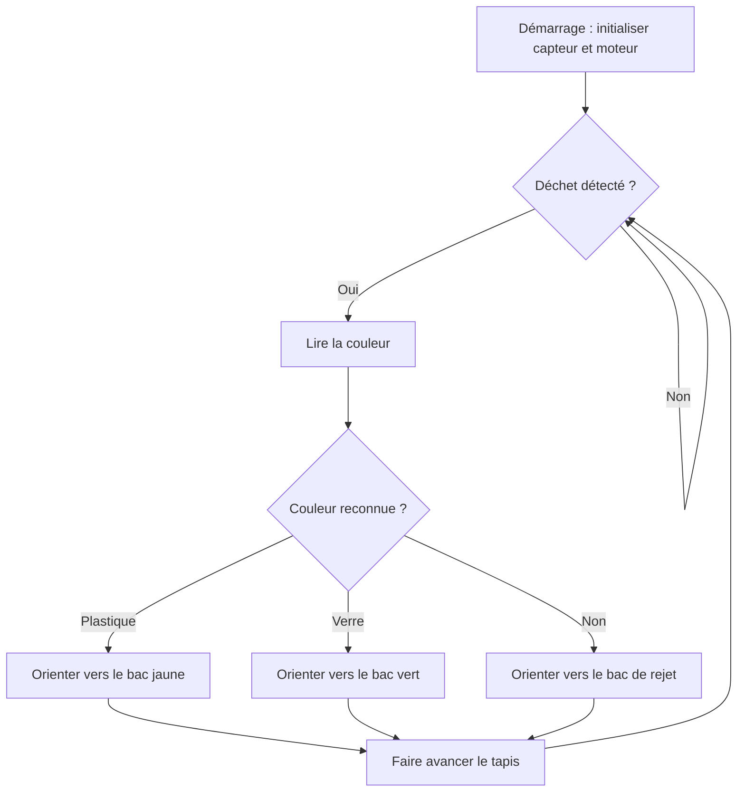
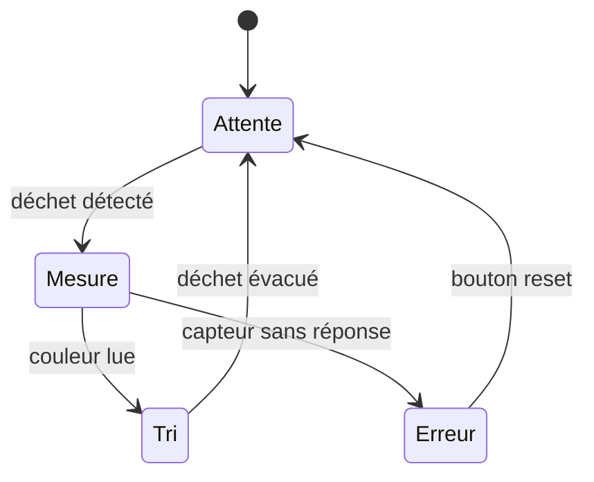
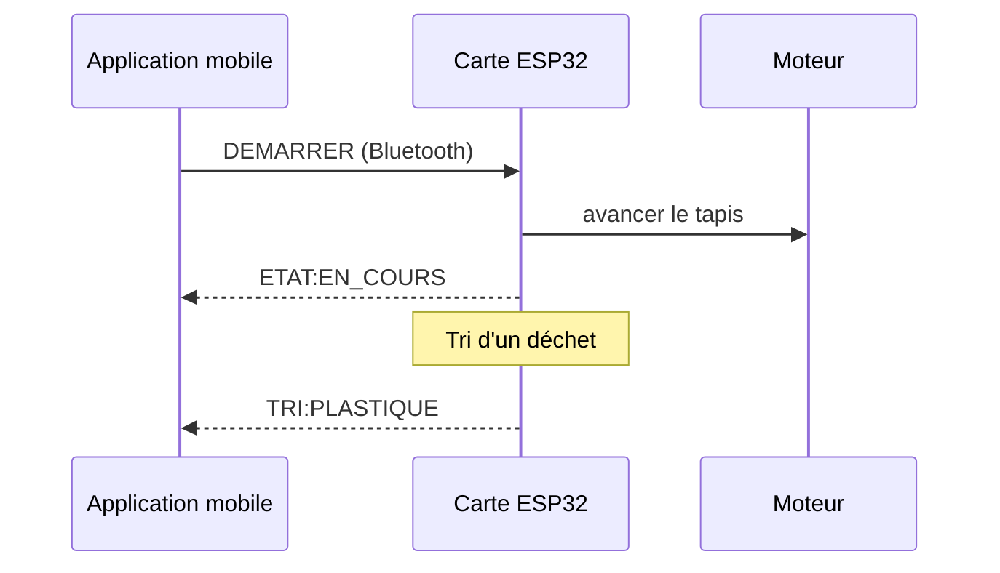

## Deux niveaux de documentation de code

- **Le niveau fichier/fonction** : des commentaires directement dans le
  code, pour qui le lit ligne par ligne.
- **Le niveau projet** : un README ou une page qui explique l'architecture
  générale, avant même d'ouvrir un fichier.

Les deux sont nécessaires : l'un sans l'autre laisse toujours un trou.

## Commenter utilement, pas commenter beaucoup



```cpp
// incrémente i
i++;

// boucle
for (int i = 0; i < 10; i++) {
  // fait le calcul
  x = x + i;
}
```





```cpp
// Moyenne glissante sur les 10 dernières mesures du capteur,
// pour lisser le bruit de lecture (voir la pré-étude, page Études du site)
for (int i = 0; i < 10; i++) {
  somme = somme + mesures[i];
}
```







## Où documenter le code dans le template

Le template prévoit trois emplacements, un par type d'information :

| Emplacement | Ce qu'on y met |
|---|---|
| `project/firmware/<nom-du-projet>/` | Le code du firmware lui-même, un dossier par projet PlatformIO |
| `project/firmware/README.md` | Carte cible, bibliothèques, organisation des fichiers, comment compiler et téléverser |
| `docs/conception/firmware.md` | Sur le site : l'architecture du code (boucle principale, machine à états), l'environnement |
| `docs/conception/software.md` et `project/software/` | Idem pour une application sur ordinateur, téléphone ou navigateur |

Supprimez la page et le dossier qui ne concernent pas votre projet (pas de
partie logicielle ? supprimez `software.md` et `project/software/`).

### Documenter par sous-ensemble

Un projet pluridisciplinaire se découpe en **sous-ensembles** : la pince et
le châssis d'un robot, le module de mesure et l'affichage d'une station
météo, le capteur et l'interface d'un dispositif d'aide à la personne... C'est
déjà ce découpage que suit la page **Conception** du template. Le code gagne à
suivre le même découpage : un lecteur qui s'intéresse à un sous-ensemble doit
trouver au même endroit sa mécanique, son électronique **et** le code qui le
pilote. L'exemple ci-dessous reprend le robot de tri de cet atelier.

Concrètement :

- **Dans le code**, un module par sous-ensemble dans `lib/` (le programme
  principal `src/main.cpp` ne fait que les appeler) :

```text
firmware/mon-robot/
├── platformio.ini
├── include/
│   └── pins.h              toutes les broches, en un seul endroit
├── src/
│   └── main.cpp            boucle principale : appelle les sous-ensembles
└── lib/
    ├── pince/              ouvrir, fermer, détecter un objet saisi
    ├── chassis/            avancer, tourner, s'arrêter
    └── capteur_couleur/    lire et calibrer le capteur
```

- **Sur le site**, `docs/conception/firmware.md` présente la vue d'ensemble
  (la boucle principale, qui appelle quoi), puis chaque sous-ensemble a sa
  partie code : soit une sous-page du firmware (`parent: Firmware`), soit une
  section « Code » dans la page du sous-ensemble lui-même (par exemple dans
  `docs/conception/mecanique/pince.md`), si votre équipe a choisi de
  découper la conception par sous-ensemble plutôt que par domaine.
- **Dans l'équipe**, le responsable d'un sous-ensemble (voir
  [Constituer et organiser son équipe](/workshops/methodologie-de-projet/concepts/constituer-organiser-equipe/))
  documente aussi le code de ce sous-ensemble : c'est lui qui sait pourquoi
  il est écrit ainsi.

Les numéros de broches ne sont écrits dans aucun module : ils sont tous
regroupés dans `include/pins.h`, et documentés dans un tableau sur la page de
la carte. Voir la section « Le brochage » de
[Documenter une carte électronique](/workshops/methodologie-de-projet/tutorials/documenter-carte-electronique/).

Pour chaque sous-ensemble, la documentation du code répond aux mêmes quatre
questions : **ce qu'il fait**, **ce qu'il utilise** (broches, capteurs,
bibliothèques), **comment les autres parties l'appellent** (les fonctions
publiques du module) et **comment le tester seul**.

## Code de la pince

**Rôle :** ouvrir et fermer la pince, détecter qu'un objet est saisi.

**Utilise :** servomoteur SG90 sur la broche 18, microrupteur de fin de
course sur la broche 19.

**Fonctions appelées par le reste du code** (`lib/pince/pince.h`) :

- `pinceOuvrir()` : ouvre complètement la pince
- `pinceFermer()` : ferme la pince, s'arrête dès que le microrupteur est appuyé
- `pinceObjetSaisi()` : renvoie `true` si un objet est tenu

**Tester seul :** un petit programme de test ouvre et ferme la pince en
boucle et affiche l'état du microrupteur sur le moniteur série (115200 bauds).



## Documenter l'architecture

Une page (`docs/conception/firmware.md`, ou un `README.md` dans le dossier du
code) qui répond à : comment le code est organisé en fichiers/modules,
quelles librairies utilisées et pourquoi (lien avec
[Tracer ses choix techniques](/workshops/methodologie-de-projet/concepts/tracer-choix-techniques/)),
et comment compiler et téléverser le tout.

Le firmware du template se développe avec **VSCode** et l'extension
**PlatformIO** (voir
[Installation de VSCode](/docs/tutorials/software/vscode-platformio/installation-vscode/)
et [Installation de PlatformIO](/docs/tutorials/software/vscode-platformio/installation-platformio/)).
Un projet PlatformIO s'organise toujours ainsi :

```text
firmware/
└── mon-robot/
    ├── platformio.ini    carte, framework, bibliothèques
    ├── src/
    │   └── main.cpp      programme principal
    ├── include/          fichiers .h
    └── lib/              bibliothèques écrites par l'équipe
```

## Architecture du firmware

- `src/main.cpp` : boucle principale, lecture capteurs et pilotage moteur
- `lib/capteur_couleur/` : lecture et calibration du capteur TCS3200
- `lib/moteur/` : pilotage du moteur pas à pas via le driver A4988

## Librairies utilisées

- `AccelStepper` : gestion du moteur pas à pas, choisie pour son support natif de l'accélération (déclarée dans `platformio.ini`)

## Compiler et téléverser

1. Dans VSCode, ouvrir le dossier `firmware/mon-robot/` (et non la racine du repo)
2. Brancher la carte en USB
3. Barre du bas : ✓ pour compiler, → pour téléverser





## Montrer du code dans la documentation

La documentation ne recopie pas le code : elle en montre des **extraits**
pour expliquer un point précis. La syntaxe de base (code inline, blocs de
code) est dans [Syntaxe Markdown](/workshops/methodologie-de-projet/tutorials/syntaxe-markdown/) ;
cette section explique comment bien s'en servir.

### Le bon langage pour chaque bloc

Le langage indiqué après les trois backticks active la coloration
syntaxique. Ceux dont un projet a le plus souvent besoin :

| Après les trois backticks | Pour quoi faire |
|---|---|
| `cpp` | Code Arduino, ESP32, PlatformIO (fichiers `.cpp`, `.ino`, `.h`) |
| `python` | Scripts et applications |
| `bash` | Commandes à taper dans un terminal |
| `ini` | Le fichier `platformio.ini` |
| `yaml` | Les fichiers de configuration (`_config.yml`) et l'en-tête des pages |
| `json` | Fichiers de configuration, messages échangés entre la carte et une application |
| `html` | Balises HTML, intégration d'une vidéo |
| `markdown` | Montrer du Markdown, par exemple un gabarit de documentation |
| `text` | Arborescences de dossiers, sortie du moniteur série, tout ce qui n'est pas du code |

### Choisir et introduire un extrait

Un bloc de code de documentation n'a pas le même rôle que le fichier de
code lui-même : il sert à **expliquer un point précis**.

- **Un extrait, pas tout le fichier.** Dix à vingt lignes qui illustrent une
  idée. Le code complet vit dans `project/` : le recopier en entier dans la
  documentation crée un doublon, périmé à la prochaine modification.
- **Du code qui fonctionne.** Copiez l'extrait depuis votre fichier, ne le
  retapez pas : une faute de frappe dans la documentation est un bug pour le
  lecteur.
- **Le fichier avant le bloc.** Une phrase qui dit de quel fichier vient
  l'extrait (`src/main.cpp`) et pourquoi on le montre.
- **Les coupes visibles.** Marquez ce qui est omis avec un commentaire
  `// ...` (ou `# ...` en Python).
- **Une commande par ligne, sans le prompt.** N'écrivez pas le `$` du
  terminal devant : le lecteur pourra copier tout le bloc. La réponse de la
  commande va dans un bloc `text` séparé.

#### Exemple : un extrait de code dans une page de documentation

Voici ces règles appliquées dans une page de votre site. L'onglet **Source**
montre ce que vous écrivez dans le fichier `.md`, l'onglet **Rendu** ce que
le lecteur voit sur le site.



````markdown
Dans `src/main.cpp`, la lecture du capteur est lissée sur 10 mesures :

```cpp
// ...
for (int i = 0; i < 10; i++) {
  somme += analogRead(PIN_CAPTEUR);
}
int moyenne = somme / 10;
// ...
```

Pour prévisualiser le site, depuis le dossier `docs/` :

```bash
bundle exec jekyll serve
```

Le terminal affiche alors :

```text
Server address: http://127.0.0.1:4000/
Server running... press ctrl-c to stop.
```
````





Dans `src/main.cpp`, la lecture du capteur est lissée sur 10 mesures :

```cpp
// ...
for (int i = 0; i < 10; i++) {
  somme += analogRead(PIN_CAPTEUR);
}
int moyenne = somme / 10;
// ...
```

Pour prévisualiser le site, depuis le dossier `docs/` :

```bash
bundle exec jekyll serve
```

Le terminal affiche alors :

```text
Server address: http://127.0.0.1:4000/
Server running... press ctrl-c to stop.
```





Sur le site de votre projet, chaque bloc de code affiche un bouton **Copy** :
le lecteur récupère le bloc en un clic, d'où l'importance qu'il soit exact
et sans prompt.

## Décrire l'algorithme avec Mermaid

Avant d'entrer dans les fichiers, un lecteur a besoin de la **logique** du
code : dans quel ordre les choses se passent, quelles décisions sont prises,
qui parle à qui. Un schéma le montre mieux que cent lignes de code. Le site
de votre projet sait dessiner ces schémas avec
[Mermaid](https://mermaid.js.org/) : vous écrivez le schéma **en texte**,
dans un bloc de code de langage `mermaid`, et il s'affiche sous forme de
diagramme.

L'avantage du texte : le schéma vit dans le même repo que le code, se modifie
en deux secondes quand le code change, et Git en garde l'historique. Pas de
fichier image à regénérer.



Trois types de schémas couvrent presque tous les besoins d'un firmware.

### L'organigramme : le déroulement du programme

Pour montrer les étapes et les décisions (les `if`) de la boucle principale.
Chaque étape est un rectangle `[...]`, chaque question un losange `{...}`,
et les flèches `-->` portent la réponse entre `|...|`.

````markdown

````


### Le diagramme d'états : une machine à états

Beaucoup de firmwares sont des **machines à états** : le système est
toujours dans un seul état (attente, mesure, tri...), et un événement le fait
passer au suivant. Le diagramme d'états les montre directement, et il se
traduit presque ligne à ligne en un `switch` dans le code.

````markdown

````


### Le diagramme de séquence : les échanges entre parties

Quand plusieurs éléments communiquent (la carte et une application, deux
cartes entre elles, un capteur en I2C), le diagramme de séquence montre
**qui envoie quoi à qui, et dans quel ordre**. Il complète la section
« Communication avec la carte » de la page `software.md` du template.

````markdown

````


### Quel schéma pour quoi ?

| Vous voulez montrer | Schéma Mermaid | Mot-clé |
|---|---|---|
| Les étapes et les décisions de la boucle principale | Organigramme | `flowchart TD` |
| Les états du système et ce qui le fait changer d'état | Diagramme d'états | `stateDiagram-v2` |
| Les messages échangés entre la carte, une application, un capteur | Diagramme de séquence | `sequenceDiagram` |
| Les modules du code et qui appelle qui (un par sous-ensemble) | Organigramme de gauche à droite | `flowchart LR` |

Quelques conseils :

- **Un schéma par idée**, pas un schéma géant de tout le programme. Sur le
  site, placez le schéma global dans `docs/conception/firmware.md` et un
  schéma détaillé par sous-ensemble dans sa propre partie.
- **Des mots, pas du code** dans les boîtes : « Lire la couleur », pas
  `lireCouleur(PIN_S0, PIN_S1)`. Le schéma explique, le code détaille.
- **Tenez-le à jour** : quand la logique change, modifiez le schéma dans le
  même commit que le code.
- **Testez vos schémas** sur l'[éditeur en ligne de Mermaid](https://mermaid.live/) :
  il affiche le résultat en direct et signale les erreurs de syntaxe.

La syntaxe complète est dans la
[documentation de Mermaid](https://mermaid.js.org/intro/). Pour la
présentation des blocs de code en général, voir
[Syntaxe Markdown](/workshops/methodologie-de-projet/tutorials/syntaxe-markdown/).

## Exercice

1. Relisez votre code : supprimez les commentaires qui répètent l'évident,
   ajoutez-en sur les parties qui vous ont demandé réflexion.
2. Complétez `project/firmware/README.md` et rédigez la page
   `docs/conception/firmware.md` avec le gabarit d'architecture, en y
   ajoutant au moins un extrait de code bien introduit (fichier nommé,
   langage indiqué, coupes marquées par `// ...`).
3. Écrivez en trois ou quatre phrases la logique de votre boucle principale,
   puis traduisez-la en organigramme (ou en diagramme d'états si votre code
   est une machine à états) sur la page `firmware.md`.
4. Pour chaque sous-ensemble, remplissez le gabarit de sous-ensemble.

---

*Crédit photo : « Code, data, programming » via [picryl](https://picryl.com/media/code-data-programming-code-science-technology-792e76), sous licence ouverte.*
{: .is-size-7 .has-text-grey }
