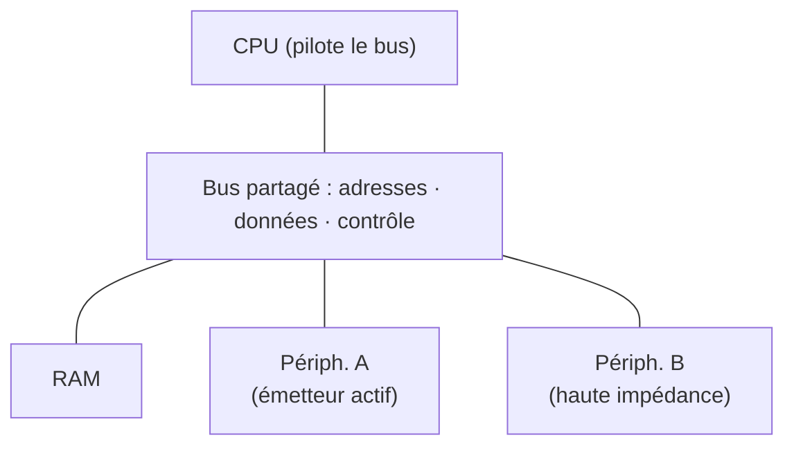
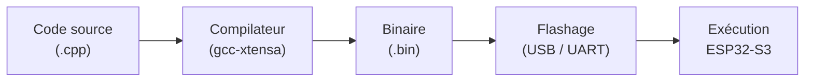

## Au programme

1. Un ordinateur sur une puce
2. Sous le capot
3. Du code à la puce
4. Votre premier programme

<aside class="notes" markdown="1">
1 h 30 de cours, sans manipulation. Fil rouge de tout l'atelier : un Pong 2 joueurs sur ESP32-S3, puis un Snake multijoueur en projet.
Parties 1 et 2 : le vocabulaire et la puce. Parties 3 et 4 : la chaîne de développement, plus concrètes, à garder pour la seconde moitié quand l'attention baisse.
</aside>

---

## Ce que vous saurez faire

### À la fin de ce cours, vous saurez :

- dire ce qu'est un microcontrôleur, et ce qui le distingue d'un PC
- nommer les blocs d'une puce : CPU, Flash, RAM, périphériques, bus
- expliquer ce qu'est un **registre**, et à quoi sert une **interruption**
- suivre le trajet du code source jusqu'à l'exécution sur la puce
- dire pourquoi `delay()` pose problème dans une `loop()`

Fil rouge de l'atelier : un **Pong 2 joueurs**, puis un **Snake multijoueur**.
{: .caption}

[L'atelier Microcontrôleurs](/workshops/microcontroleur/){: .doc-link}

---

<!-- .slide: class="slide-section" -->

## Un ordinateur sur une puce

Percevoir, décider, agir

---

## Activité : comptez-les autour de vous

<p class="activity-meta"><span><i class="fas fa-users"></i>Toute la classe</span><span><i class="far fa-clock"></i>3 min</span><span><i class="fas fa-pen"></i>Sans PC</span></p>

### Combien d'ordinateurs y a-t-il dans cette pièce ?

- Une réponse par personne, à voix haute
- On note les chiffres au tableau, du plus petit au plus grand

<aside class="notes" markdown="1">
Les réponses tournent en général autour du nombre de PC portables. Dévoiler ensuite la slide suivante : on est deux ordres de grandeur en dessous.
</aside>

---

## Il y en a des centaines

- {: .fragment} Le **micro-ondes** qui compte les secondes et fait tourner le plateau
- {: .fragment} La **machine à laver** qui enchaîne lavage, rinçage, essorage
- {: .fragment} La **télécommande**, les **écouteurs sans fil**, la **manette** de jeu
- {: .fragment} La **trottinette**, le **thermostat**, le **détecteur de fumée**
- {: .fragment} Et **50 à 150** dans une voiture récente : vitres, clignotants, airbags, injection

Aucun n'a besoin d'un « vrai » ordinateur. Ils ont besoin d'une puce à quelques euros, qui démarre instantanément et fait sa tâche en boucle.
{: .fragment .caption}

[Qu'est-ce qu'un microcontrôleur ?](/workshops/microcontroleur/concepts/qu-est-ce-qu-un-microcontroleur/){: .doc-link}

---

## Toujours la même boucle


Un thermostat *perçoit* la température, *décide* qu'il fait trop froid, *agit* en allumant le chauffage. Puis il recommence, indéfiniment.

Cette boucle, vous la retrouverez telle quelle dans votre Pong : lire le joystick, calculer la position de la balle, redessiner l'écran.
{: .fragment .caption}

[Qu'est-ce qu'un microcontrôleur ?](/workshops/microcontroleur/concepts/qu-est-ce-qu-un-microcontroleur/){: .doc-link} [Les capteurs](/docs/concepts/capteurs/){: .doc-link}

---

## Le « décider », c'est vous.

Le microcontrôleur ne sait rien faire tout seul. Sans programme, c'est une puce inerte : tout l'atelier consiste à écrire ce comportement.
{: .fragment .caption}

---

## Le vocabulaire de l'atelier

| Terme | Ce que c'est | Exemples du projet |
|---|---|---|
| **Capteur** | Traduit une grandeur physique en signal électrique | bouton, joystick, potentiomètre |
| **Actionneur** | Transforme un signal électrique en action | LED, écran, moteur, buzzer |
| **Broche** (*pin*) | Une patte de la puce, reliée au monde extérieur | GPIO5, GPIO1 |
| **Programme** | La suite d'instructions que vous écrivez | `main.cpp` |
{: .table-dense}

Un bouton est un capteur, une LED est un actionneur.
{: .caption}

[Les capteurs](/docs/concepts/capteurs/){: .doc-link}

---

## Pourquoi pas un « vrai » ordinateur ?

| | Ordinateur classique | Microcontrôleur |
|---|---|---|
| **Tâches** | Des milliers, en même temps | Une seule, en boucle |
| **Prix** | Plusieurs centaines d'€ | Quelques euros, parfois centimes |
| **Énergie** | Se branche au secteur | Des mois sur une pile |
| **Démarrage** | Plusieurs secondes | Instantané |
| **Système** | Un OS complet | Aucun, en général |
{: .table-dense}

C'est cette sobriété qui le rend si présent : on peut en mettre partout, pour presque rien, sans y penser.
{: .fragment .caption}

[Qu'est-ce qu'un microcontrôleur ?](/workshops/microcontroleur/concepts/qu-est-ce-qu-un-microcontroleur/){: .doc-link}

---

## Et le Raspberry Pi, alors ?

<div class="columns" markdown="1">
<div markdown="1">

### Microcontrôleur

Une seule tâche, du temps réel, très peu d'énergie, démarrage immédiat.

**ESP32-S3, Arduino, STM32**

</div>
<div markdown="1">

### Nano-ordinateur

Un vrai système d'exploitation (Linux), un écran, le réseau complet, beaucoup de mémoire.

**Raspberry Pi**

</div>
</div>

La question à se poser n'est pas « lequel est le plus puissant » mais « de quoi ai-je réellement besoin ». Un Raspberry Pi qui met 20 secondes à démarrer ne peut pas déclencher un airbag.
{: .fragment .caption}

[Qu'est-ce qu'un microcontrôleur ?](/workshops/microcontroleur/concepts/qu-est-ce-qu-un-microcontroleur/){: .doc-link}

---

## Notre puce : l'ESP32-S3

| Caractéristique | Valeur |
|---|---|
| CPU | Xtensa LX7 **dual-core** 32 bits, 240 MHz |
| RAM | 512 Ko SRAM (+ 8 Mo PSRAM en option) |
| Flash | 16 Mo, externe via SPI |
| GPIO | 45 broches, dont 20 capables d'ADC |
| Tension logique | **3,3 V** |
| Connectivité | Wi-Fi 802.11 b/g/n + Bluetooth 5 |
| Prix | ~8 € la carte de développement |
{: .table-dense}

Le sans-fil servira au projet Snake. **↓** pour le brochage de la carte.
{: .caption}

[ESP32-S3-DevKitC-1](/docs/references/hardware/esp32-s3-devkitc-1/){: .doc-link}

<!-- .down -->

## La fiche de la carte

<iframe class="page-preview" data-src="/docs/references/hardware/esp32-s3-devkitc-1/#broches-à-connaître" title="Fiche de référence ESP32-S3-DevKitC-1"></iframe>

---



[GPIO et monde numérique](/workshops/microcontroleur/concepts/gpio-monde-numerique/){: .doc-link}

---

<!-- .slide: class="slide-section" -->

## Sous le capot

CPU, mémoires, périphériques, bus

---

## Le schéma-bloc, votre carte mentale

{: .img-md}

Chaque concept de l'atelier détaille l'une de ces briques.
{: .caption}

[Architecture d'un microcontrôleur](/workshops/microcontroleur/concepts/architecture-microcontroleur/){: .doc-link}

---

## Cinq briques, une seule puce

| Bloc | Rôle | Accès logiciel |
|---|---|---|
| **CPU** | Exécute les instructions une par une | direct |
| **Flash** | Stocke le programme (persistant) | lecture à l'exécution |
| **RAM** | Variables, pile d'appels (volatile) | lecture/écriture rapide |
| **Périphériques** | GPIO, ADC, UART, SPI, PWM | via **registres** |
| **Bus** | Relie tout le monde | transparent sous Arduino |
{: .table-dense}

Tout est sur le même silicium : un **système sur puce**. Il suffit de l'alimenter.
{: .fragment .caption}

[Architecture d'un microcontrôleur](/workshops/microcontroleur/concepts/architecture-microcontroleur/){: .doc-link}

---

<!-- .slide: data-auto-animate -->

## Le CPU ne sait faire qu'une chose

<div class="demo-flow">
  <div class="demo-box is-big" data-id="fetch">Fetch</div>
</div>

**Fetch** : aller chercher en Flash l'instruction suivante, à l'adresse indiquée par le compteur de programme.

---

<!-- .slide: data-auto-animate -->

## Le CPU ne sait faire qu'une chose

<div class="demo-flow">
  <div class="demo-box" data-id="fetch">Fetch</div>
  <span class="demo-arrow" data-id="a1">→</span>
  <div class="demo-box is-big" data-id="decode">Decode</div>
</div>

**Decode** : comprendre ce que l'instruction demande, et sur quelles données.

---

<!-- .slide: data-auto-animate -->

## Le CPU ne sait faire qu'une chose

<div class="demo-flow">
  <div class="demo-box" data-id="fetch">Fetch</div>
  <span class="demo-arrow" data-id="a1">→</span>
  <div class="demo-box" data-id="decode">Decode</div>
  <span class="demo-arrow" data-id="a2">→</span>
  <div class="demo-box is-accent is-big" data-id="execute">Execute</div>
</div>

**Execute** : calculer dans l'**ALU**, ou transférer une donnée. Puis recommencer, **240 millions de fois par seconde**.

Au fond, un CPU ne fait que deux choses : calculer, et déplacer des octets d'un endroit à un autre.
{: .fragment .caption}

[Architecture d'un microcontrôleur](/workshops/microcontroleur/concepts/architecture-microcontroleur/){: .doc-link}

---

## 240 MHz, ça veut dire quoi ?

| Opération | Ordre de grandeur |
|---|---|
| Un `digitalWrite()` | quelques cycles |
| Une multiplication entière | quelques dizaines de cycles |
| Redessiner un écran 240×240 en SPI | quelques millions de cycles |
| Établir une connexion Wi-Fi | plusieurs centaines de millions |
{: .table-dense}

À 60 images par seconde, chaque image dispose de **4 millions de cycles**.
{: .fragment .highlight-red}

[Architecture d'un microcontrôleur](/workshops/microcontroleur/concepts/architecture-microcontroleur/){: .doc-link}

---

## Deux cœurs, et le droit de dormir

- L'ESP32-S3 a **deux cœurs** Xtensa LX7 : sous Arduino, `setup()`/`loop()` tournent sur le cœur 1, le Wi-Fi occupe le cœur 0 en arrière-plan
- Couper l'horloge d'un périphérique inutilisé économise de l'énergie
- Les **modes veille** (*light sleep*, *deep sleep*) éteignent tout ou partie de la puce
- Le **RTC** continue de tourner en veille profonde pour réveiller la carte à l'heure dite

C'est ce qui permet à un capteur sur pile de tenir des mois : il dort 99,9 % du temps.
{: .fragment .caption}

[Architecture d'un microcontrôleur](/workshops/microcontroleur/concepts/architecture-microcontroleur/){: .doc-link}

---

## Deux mémoires, deux usages

| | Flash | RAM (SRAM) |
|---|---|---|
| **Contenu** | Programme compilé, constantes | Variables, pile, heap |
| **Persistance** | Survit au reset | Perdue à l'extinction |
| **Vitesse** | Plus lente | Très rapide |
| **Taille** | 16 Mo | 512 Ko |
{: .table-dense}

Deux espaces d'adressage séparés : une architecture **Harvard modifiée**.
{: .fragment .caption}

[Architecture d'un microcontrôleur](/workshops/microcontroleur/concepts/architecture-microcontroleur/){: .doc-link}

---

## Le glossaire des périphériques

| Sigle | Nom complet | Rôle |
|---|---|---|
| **GPIO** | General Purpose Input/Output | Entrée ou sortie numérique |
| **ADC** | Analog to Digital Converter | Tension vers nombre |
| **UART / I2C / SPI** | | Bus série |
| **Timer** | Compteur matériel | Événements périodiques, PWM |
| **DMA** | Direct Memory Access | Transfert sans le CPU |
| **RTC** | Real-Time Clock | Horloge, même en veille |
| **Watchdog** | Chien de garde | Redémarre si blocage |
{: .table-dense}

Chaque sigle aura sa slide au CM2 ou au CM3.
{: .caption}

[Architecture d'un microcontrôleur](/workshops/microcontroleur/concepts/architecture-microcontroleur/){: .doc-link}

---



[ADC et PWM](/workshops/microcontroleur/concepts/adc-pwm/){: .doc-link}

---

## Le bus : une autoroute partagée



Trois faisceaux : l'**adresse** dit à qui on parle, les **données** transitent, le **contrôle** précise « je lis » ou « j'écris ».

[Architecture d'un microcontrôleur](/workshops/microcontroleur/concepts/architecture-microcontroleur/){: .doc-link}

---

## Un seul composant parle à la fois

Si deux périphériques poussaient une valeur en même temps sur le bus de données, l'un forçant un 0 et l'autre un 1, ce serait un **court-circuit**.

D'où les sorties **trois états** : en plus de 0 et 1, un état de **haute impédance** qui déconnecte électriquement le composant de la ligne.

À tout instant, un seul émetteur est actif ; tous les autres sont à l'écoute. C'est l'adresse qui désigne celui qui a le droit de répondre.
{: .fragment .highlight-red}

Retenez le mot **haute impédance** : il reviendra au CM2 avec les entrées flottantes, et au CM3 avec l'I2C.
{: .fragment .caption}

[Architecture d'un microcontrôleur](/workshops/microcontroleur/concepts/architecture-microcontroleur/){: .doc-link}

---

## Les registres : l'interface matériel / logiciel

Chaque périphérique se pilote par des **registres** : de simples cases mémoire à une adresse fixe.

- Écrire dans un registre allume une LED
- Lire un registre donne l'état d'un bouton
- {: .fragment .highlight-red} `digitalWrite(LED, HIGH)` écrit dans le bon registre

Ranger une variable et allumer une LED : la même opération, poser une valeur à une adresse.
{: .fragment .caption}

[Architecture d'un microcontrôleur](/workshops/microcontroleur/concepts/architecture-microcontroleur/){: .doc-link}

---

## Réagir sans attendre : l'interruption

<pre><code class="language-cpp" data-trim data-line-numbers="1|2|6">
void IRAM_ATTR surAppui() {
  compteurAppuis++;   // aussi court et rapide que possible
}

void setup() {
  attachInterrupt(digitalPinToInterrupt(BTN_PIN), surAppui, FALLING);
}
</code></pre>

Le CPU suspend `loop()`, exécute la petite fonction, puis reprend exactement où il s'était arrêté.

`IRAM_ATTR` la place en RAM interne : sans ce mot-clé, la puce finit par planter.
{: .caption}

<aside class="notes" markdown="1">
Insister : tant que l'ISR s'exécute, tout le reste est suspendu, y compris les autres interruptions. Une ISR ne fait jamais de `Serial.println()`, jamais de `delay()`, jamais d'appel à une bibliothèque. Elle positionne un drapeau, et la `loop()` fait le travail.
</aside>

[Architecture d'un microcontrôleur](/workshops/microcontroleur/concepts/architecture-microcontroleur/){: .doc-link} [GPIO et monde numérique](/workshops/microcontroleur/concepts/gpio-monde-numerique/){: .doc-link}

---

<!-- .slide: class="slide-section" -->

## Du code à la puce

Compiler, flasher, exécuter

---

## Le voyage complet



Un clic sur **Upload** déclenche les quatre étapes, toujours dans cet ordre. Quand quelque chose échoue, la première question est : **à quelle étape ?**

[Du matériel au logiciel](/workshops/microcontroleur/concepts/du-materiel-au-logiciel/){: .doc-link}

---

## La toolchain Arduino-ESP32

| Élément | Rôle |
|---|---|
| **Compilateur** (gcc pour Xtensa) | Traduit le C++ en instructions machine |
| **Core Arduino** | Fournit `pinMode()`, `digitalWrite()`, `analogRead()` |
| **Uploader** (esptool) | Transfère le binaire vers la Flash, par USB |
{: .table-dense}

L'IDE ne fait qu'orchestrer ces trois outils. Arduino IDE ou PlatformIO, la chaîne reste la même : **compiler, flasher, exécuter**.
{: .fragment .caption}

[PlatformIO](/docs/references/software/platformIO/){: .doc-link} [Arduino IDE](/docs/references/software/arduino-ide/){: .doc-link}

---

## « Compiler » recouvre trois étapes

1. **Préprocesseur** : traite les `#include` et les `#define`, colle le contenu des bibliothèques
2. **Compilation** : chaque fichier C++ devient du code objet, séparément
3. **Édition de liens** : tous les objets sont assemblés en un binaire, en résolvant les références

Savoir les distinguer, c'est savoir lire une erreur. C'est la compétence la plus rentable du semestre.
{: .caption}

[Du matériel au logiciel](/workshops/microcontroleur/concepts/du-materiel-au-logiciel/){: .doc-link}

---

## Lire une erreur

| Message | Étape | Cause probable |
|---|---|---|
| `expected ';' before ...` | compilation | une faute de syntaxe, souvent une ligne **avant** |
| `'x' was not declared` | compilation | variable mal orthographiée, ou `#include` manquant |
| `undefined reference to ...` | édition de liens | bibliothèque absente de `lib_deps` |
| `A fatal error occurred: Failed to connect` | flashage | mauvais port, câble sans data, bouton **BOOT** |
{: .table-dense}

Corrigez la **première** erreur, pas les 40 suivantes.
{: .fragment .highlight-red}

[Du matériel au logiciel](/workshops/microcontroleur/concepts/du-materiel-au-logiciel/){: .doc-link}

---

## Au reset : la séquence de démarrage

1. **ROM bootloader** : gravé en usine, il lit les broches de *strapping* (dont GPIO0) pour choisir démarrage normal ou mode téléversement
2. **Bootloader de second niveau** : chargé depuis la Flash, il initialise horloge et mémoire, choisit la partition à lancer
3. **Votre application** : `setup()` une fois, puis `loop()` sans fin

C'est exactement ce que force le bouton **BOOT** maintenu au reset : il bloque l'étape 1 en mode téléversement.
{: .fragment .caption}

[Du matériel au logiciel](/workshops/microcontroleur/concepts/du-materiel-au-logiciel/){: .doc-link}

---



[Vérification de la toolchain](/workshops/microcontroleur/tutorials/toolchain-blink/){: .doc-link}

---

## Tout un programme en deux fonctions

```cpp
void setup() {                      // une seule fois, au démarrage
  pinMode(LED_PIN, OUTPUT);
  Serial.begin(115200);
}

void loop() {                       // en boucle, jusqu'à la coupure
  digitalWrite(LED_PIN, HIGH);
  delay(500);
  digitalWrite(LED_PIN, LOW);
  delay(500);
}
```

Pas de `main()` : le core Arduino l'écrit, et appelle `setup()` puis `loop()`.
{: .caption}

[Du matériel au logiciel](/workshops/microcontroleur/concepts/du-materiel-au-logiciel/){: .doc-link}

---

## Pas de système d'exploitation

Sur un ordinateur, votre programme est un processus parmi d'autres. Ici, il n'y a **rien** autour de lui :

- {: .fragment} pas de multitâche : `loop()` tourne seul
- {: .fragment} pas de `sleep()` : un `delay()` bloque **tout**, boutons compris
- {: .fragment} pas d'arrêt propre : couper le courant coupe le programme net

En contrepartie, le comportement est **prévisible à la milliseconde près**.
{: .fragment .caption}

[Du matériel au logiciel](/workshops/microcontroleur/concepts/du-materiel-au-logiciel/){: .doc-link}

---

## Activité : trouvez le bug

<p class="activity-meta"><span><i class="fas fa-user-friends"></i>En binôme</span><span><i class="far fa-clock"></i>3 min</span><span><i class="fas fa-pen"></i>Sans PC</span></p>

```cpp
void loop() {
  digitalWrite(LED, HIGH);
  delay(500);
  digitalWrite(LED, LOW);
  delay(500);

  if (digitalRead(BOUTON) == LOW) {
    tirer();
  }
}
```

### Le joueur appuie sur le bouton. Que se passe-t-il ?

<aside class="notes" markdown="1">
Réponse attendue : le bouton n'est lu qu'une fois par seconde, et seulement à l'instant précis où le programme atteint la ligne. Un appui de 200 ms a une chance sur cinq d'être vu. Enchaîner sur la slide suivante.
</aside>

---

## Correction : le bouton n'est presque jamais lu

Le programme passe **1 seconde sur 1** dans les `delay()`. Le `digitalRead()` n'est atteint qu'une fois par tour.

- {: .fragment} Un appui court de 200 ms : vu une fois sur cinq
- {: .fragment} Ajoutez un écran à rafraîchir : le jeu devient injouable
- {: .fragment .highlight-red} La solution n'est pas de raccourcir le `delay()`, c'est de ne **jamais** bloquer

[Du matériel au logiciel](/workshops/microcontroleur/concepts/du-materiel-au-logiciel/){: .doc-link}

---

## Ne jamais bloquer : regarder l'heure

<pre><code class="language-cpp" data-trim data-line-numbers="1-3|6-10|7">
unsigned long dernierClignotement = 0;
const unsigned long INTERVALLE = 500;   // ms
int etatLed = LOW;

void loop() {
  if (millis() - dernierClignotement >= INTERVALLE) {
    dernierClignotement = millis();
    etatLed = !etatLed;
    digitalWrite(LED_PIN, etatLed);
  }
}
</code></pre>

On compare l'heure à une date mémorisée : rien n'est jamais figé.

[Du matériel au logiciel](/workshops/microcontroleur/concepts/du-materiel-au-logiciel/){: .doc-link}

---



[Du matériel au logiciel](/workshops/microcontroleur/concepts/du-materiel-au-logiciel/){: .doc-link}

---

<!-- .slide: class="slide-section" -->

## Votre premier programme

Blink, ligne par ligne

---

## Quatre lignes qui résument le cours

<pre><code class="language-cpp" data-trim data-line-numbers="1-3|6|7|8-9">
void setup() {
  pinMode(LED_BUILTIN, OUTPUT);     // configure la broche : écriture registre
}

void loop() {
  digitalWrite(LED_BUILTIN, HIGH);  // 3,3 V sur la broche
  delay(500);                       // bloque le CPU : il n'y a pas d'OS
  digitalWrite(LED_BUILTIN, LOW);   // 0 V
  delay(500);
}
</code></pre>

Architecture, registres, GPIO et absence de système d'exploitation, réunis en quatre lignes. Compilé et flashé, ce code tourne tant que la carte est alimentée.
{: .caption}

[Vérification de la toolchain](/workshops/microcontroleur/tutorials/toolchain-blink/){: .doc-link}

---



[Vérification de la toolchain](/workshops/microcontroleur/tutorials/toolchain-blink/){: .doc-link} [ESP32-S3-DevKitC-1](/docs/references/hardware/esp32-s3-devkitc-1/){: .doc-link}

---

## Le montage le plus simple

{: .img-md}

La base du montage du Pong : boutons, joystick et écran viendront s'y ajouter.
{: .caption}

[Vérification de la toolchain](/workshops/microcontroleur/tutorials/toolchain-blink/){: .doc-link}

---

## Le fichier `platformio.ini`

```ini
[env:esp32-s3-devkitc-1]
platform = espressif32        ; la famille de puces
board = esp32-s3-devkitc-1    ; la carte exacte
framework = arduino           ; le core utilisé
monitor_speed = 115200        ; la vitesse du moniteur série
lib_deps =                    ; les bibliothèques, téléchargées seules
    bodmer/TFT_eSPI@^2.5.0
```

Tout le projet est décrit ici. C'est ce fichier, versionné dans votre repo, qui permet à quelqu'un d'autre de recompiler votre code à l'identique.
{: .caption}

[PlatformIO](/docs/references/software/platformIO/){: .doc-link} [Installer PlatformIO](/docs/tutorials/software/vscode-platformio/installation-platformio/){: .doc-link}

---

## Les raccourcis PlatformIO

| Action | Raccourci | Où |
|---|---|---|
| Compiler (*Build*) | <kbd>Ctrl</kbd> <kbd>Alt</kbd> <kbd>B</kbd> | icône ✓, barre bleue |
| Téléverser (*Upload*) | <kbd>Ctrl</kbd> <kbd>Alt</kbd> <kbd>U</kbd> | icône →, barre bleue |
| Moniteur série | <kbd>Ctrl</kbd> <kbd>Alt</kbd> <kbd>S</kbd> | icône prise, barre bleue |
{: .table-dense}

Compiler avant de téléverser fait gagner du temps : les erreurs de syntaxe sortent sans attendre le flashage.
{: .caption}

[Installer VSCode](/docs/tutorials/software/vscode-platformio/installation-vscode/){: .doc-link} [Installer PlatformIO](/docs/tutorials/software/vscode-platformio/installation-platformio/){: .doc-link}

---

## Déboguer : le moniteur série

```cpp
void setup() {
  Serial.begin(115200);
}

void loop() {
  Serial.printf("x=%d y=%d btn=%d\n", x, y, btn);
}
```

Tant qu'il n'y a pas d'écran, c'est votre seul retour visuel. Afficher une variable au bon endroit résout la moitié des bugs.

[Le port série sous VSCode](/docs/tutorials/electronics/vscode-port-serie/){: .doc-link}

---



[Le port série sous VSCode](/docs/tutorials/electronics/vscode-port-serie/){: .doc-link}

---

## À retenir

- {: .fragment} Un µC = CPU + Flash + RAM + périphériques, sur **une seule puce**
- {: .fragment} Percevoir, décider, agir : le « décider », c'est votre programme
- {: .fragment} Flash = le programme (persistant), RAM = les données (volatile)
- {: .fragment} Les périphériques se pilotent par des **registres**
- {: .fragment} Code → compilation → édition de liens → flashage → exécution
- {: .fragment} **Pas d'OS** : `delay()` bloque tout, `millis()` ne bloque rien
- {: .fragment .highlight-red} Tension logique : **3,3 V**

[Architecture d'un microcontrôleur](/workshops/microcontroleur/concepts/architecture-microcontroleur/){: .doc-link} [Du matériel au logiciel](/workshops/microcontroleur/concepts/du-materiel-au-logiciel/){: .doc-link}

---

## À faire de votre côté

<p class="activity-meta"><span><i class="fas fa-laptop"></i>Sur votre machine</span><span><i class="far fa-clock"></i>30 min</span></p>

1. Installer **VSCode**, puis l'extension **PlatformIO**
2. Laisser PlatformIO télécharger la plateforme `espressif32` : c'est long, ne le faites pas au dernier moment
3. Parcourir le tutoriel de vérification de la toolchain pour savoir ce qui vous attend

Une chaîne de développement qui fonctionne avant de manipuler, c'est une séance entière de gagnée.
{: .caption}

[Installer VSCode](/docs/tutorials/software/vscode-platformio/installation-vscode/){: .doc-link} [Installer PlatformIO](/docs/tutorials/software/vscode-platformio/installation-platformio/){: .doc-link} [Vérification de la toolchain](/workshops/microcontroleur/tutorials/toolchain-blink/){: .doc-link}
