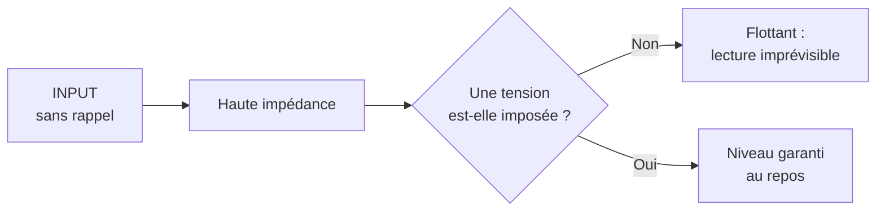
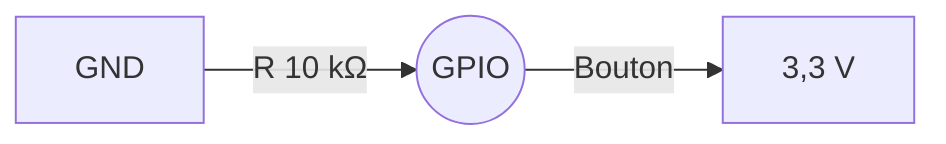

## Au programme

1. Zéro ou un
2. Une broche en sortie
3. Une broche en entrée
4. Lire le monde analogique
5. Simuler une tension

<aside class="notes" markdown="1">
1 h 30 de cours, sans manipulation. Le câblage du Pong est figé (boutons sur GPIO5/6, joystick sur GPIO1/2 en ADC1 et GPIO7) : le montrer tôt, tout le cours y renvoie.
Rappel du CM1 à faire en ouverture : percevoir → décider → agir, et `millis()` plutôt que `delay()`.
</aside>

---

## Ce que vous saurez faire

### À la fin de ce cours, vous saurez :

- distinguer un signal **numérique** d'un signal **analogique**
- configurer une broche, et calculer la résistance série d'une LED
- expliquer l'**état flottant**, et choisir entre pull-up et pull-down
- filtrer les **rebonds** d'un bouton mécanique
- lire une tension avec l'**ADC**, et la mettre à l'échelle
- produire une tension moyenne avec le **PWM**

[GPIO et monde numérique](/workshops/microcontroleur/concepts/gpio-monde-numerique/){: .doc-link} [ADC et PWM](/workshops/microcontroleur/concepts/adc-pwm/){: .doc-link}

---

<!-- .slide: class="slide-section" -->

## Zéro ou un

Les niveaux logiques

---

## Deux natures de signal

| | Numérique | Analogique |
|---|---|---|
| Valeurs possibles | 2 (`LOW` / `HIGH`) | continues, de 0 à 3,3 V |
| Fonction Arduino | `digitalRead` / `digitalWrite` | `analogRead` (ADC) |
| Dans votre montage | les boutons | les axes du joystick |
{: .table-dense}

Toute la séance tient dans ce tableau : d'abord le tout-ou-rien, ensuite le continu.
{: .fragment .caption}

[GPIO et monde numérique](/workshops/microcontroleur/concepts/gpio-monde-numerique/){: .doc-link} [ADC et PWM](/workshops/microcontroleur/concepts/adc-pwm/){: .doc-link}

---

## Les seuils de l'ESP32-S3

| Seuil | Valeur | Interprétation |
|---|---|---|
| $V_{IL}$ (LOW max) | ≤ 0,25 × VDD ≈ **0,8 V** | lu comme `LOW` |
| Zone indéterminée | ~0,8 V à ~2,5 V | lecture imprévisible |
| $V_{IH}$ (HIGH min) | ≥ 0,75 × VDD ≈ **2,5 V** | lu comme `HIGH` |
{: .table-dense}

En **sortie**, la puce garantit à l'inverse des niveaux francs : proche de 0 V, ou proche de 3,3 V.

Cette zone grise au milieu explique tout ce qui suit sur les entrées flottantes. Retenez-la.
{: .fragment .highlight-red}

[GPIO et monde numérique](/workshops/microcontroleur/concepts/gpio-monde-numerique/){: .doc-link}

---



[GPIO et monde numérique](/workshops/microcontroleur/concepts/gpio-monde-numerique/){: .doc-link} [ESP32-S3-DevKitC-1](/docs/references/hardware/esp32-s3-devkitc-1/){: .doc-link}

---

<!-- .slide: class="slide-section" -->

## Une broche en sortie

Piloter une LED

---

## Configurer, puis écrire

```cpp
pinMode(LED_PIN, OUTPUT);     // la broche devient une sortie

digitalWrite(LED_PIN, HIGH);  // 3,3 V : LED allumée
digitalWrite(LED_PIN, LOW);   // 0 V   : LED éteinte
```

*GPIO* veut dire *General Purpose Input/Output* : la même broche peut servir d'entrée ou de sortie, et c'est le logiciel qui décide, à l'exécution.

Derrière `pinMode`, un registre de configuration. Derrière `digitalWrite`, un registre de sortie.
{: .fragment .caption}

[GPIO et monde numérique](/workshops/microcontroleur/concepts/gpio-monde-numerique/){: .doc-link} [Architecture d'un microcontrôleur](/workshops/microcontroleur/concepts/architecture-microcontroleur/){: .doc-link}

---

## Toujours une résistance série

Une LED n'a quasiment pas de résistance propre : branchée seule, elle tire tout le courant que la broche peut fournir, et l'une des deux grille.

$$R = \frac{V_{alim} - V_f}{I} = \frac{3{,}3 - 2}{0{,}01} = 130\ \Omega$$

Pour une LED rouge ($V_f \approx 2$ V) à 10 mA : **150 Ω** en valeur normalisée E12.

Courant maximal par broche : ~40 mA. En pratique, rester sous **12 mA**. **↓** pour le calculateur en ligne.
{: .fragment .highlight-red}

[GPIO et monde numérique](/workshops/microcontroleur/concepts/gpio-monde-numerique/){: .doc-link}

<!-- .down -->

## Le calculateur de résistance

<iframe class="page-preview" data-src="/workshops/microcontroleur/concepts/gpio-monde-numerique/#sortie---piloter-une-led" title="Calculateur de résistance série pour LED"></iframe>

---

## Combien de LED sur une broche ?

<div class="columns" markdown="1">
<div markdown="1">

<p class="big-number">12 mA</p>

**par broche**, en pratique. Soit **une** LED correctement calibrée.

</div>
<div markdown="1">

<p class="big-number">~40 mA</p>

**le maximum absolu** de la datasheet. Au-delà, la broche est endommagée.

</div>
</div>

Pour piloter plus de courant (un moteur, un ruban de LED, un relais), la broche ne fournit pas la puissance : elle **commande** un transistor, qui lui la fournit.
{: .caption}

[GPIO et monde numérique](/workshops/microcontroleur/concepts/gpio-monde-numerique/){: .doc-link}

---

## Push-pull ou open-drain

<div class="columns" markdown="1">
<div markdown="1">

### Push-pull

Le mode par défaut d'`OUTPUT`. Deux transistors tirent activement la broche vers `HIGH` **et** vers `LOW`.

</div>
<div markdown="1">

### Open-drain

La broche ne peut que tirer vers `LOW`, ou relâcher. Indispensable sur un bus partagé comme l'I2C.

</div>
</div>

Deux composants en push-pull sur le même fil, l'un imposant 0 et l'autre 1 : c'est un court-circuit. L'open-drain règle ce problème, on le retrouvera au CM3 avec l'I2C.
{: .fragment .caption}

[GPIO et monde numérique](/workshops/microcontroleur/concepts/gpio-monde-numerique/){: .doc-link} [Les bus de communication](/workshops/microcontroleur/concepts/bus-communication/){: .doc-link}

---

<!-- .slide: class="slide-section" -->

## Une broche en entrée

Lire un bouton, vraiment

---

## Activité : le programme le plus simple du monde

<p class="activity-meta"><span><i class="fas fa-user-friends"></i>En binôme</span><span><i class="far fa-clock"></i>3 min</span><span><i class="fas fa-pen"></i>Sans PC</span></p>

```cpp
pinMode(BTN_PIN, INPUT);

void loop() {
  if (digitalRead(BTN_PIN) == HIGH) Serial.println("Appui !");
}
```

### Un bouton relie la broche au 3,3 V. Le programme est-il correct ?

<aside class="notes" markdown="1">
Réponse : non. Bouton relâché, la broche n'est reliée à rien : elle flotte, sa tension traîne dans la zone indéterminée du début de séance, et `digitalRead` rend n'importe quoi. Enchaîner.
</aside>

---

## Le piège de l'entrée nue

Une broche en entrée non connectée est en **haute impédance** : presque aucun courant ne la traverse, et **rien ne fixe sa tension**.

Elle capte alors le bruit ambiant (un câble voisin, le secteur à 50 Hz, votre main qui s'approche) et sa lecture devient aléatoire. C'est l'**état flottant**.

Le symptôme est reconnaissable : le programme « détecte des appuis » que personne ne fait.
{: .fragment .highlight-red}

[GPIO et monde numérique](/workshops/microcontroleur/concepts/gpio-monde-numerique/){: .doc-link}

---

## Pourquoi ça flotte



[GPIO et monde numérique](/workshops/microcontroleur/concepts/gpio-monde-numerique/){: .doc-link}

---

## La solution : une résistance de rappel

<div class="columns" markdown="1">
<div markdown="1">

### Pull-up : repos à HIGH


Pressé → `LOW`

</div>
<div markdown="1">

### Pull-down : repos à LOW



Pressé → `HIGH`

</div>
</div>

La résistance est là pour **fixer un niveau au repos** sans créer de court-circuit quand le bouton se ferme.
{: .fragment .caption}

[GPIO et monde numérique](/workshops/microcontroleur/concepts/gpio-monde-numerique/){: .doc-link}

---

## Le rappel est déjà dans la puce

| Mode | Au repos | Câblage requis |
|---|---|---|
| `INPUT` | flottant | résistance externe |
| `INPUT_PULLUP` | `HIGH`, tiré en interne | bouton vers **GND** |
| `INPUT_PULLDOWN` | `LOW`, tiré en interne | bouton vers 3,3 V |
{: .table-dense}

```cpp
pinMode(BTN_PIN, INPUT_PULLUP);                // pull-up interne (~45 kΩ)
bool presse = (digitalRead(BTN_PIN) == LOW);   // logique inversée
```

**La logique est inversée** : `LOW` veut dire « pressé ».
{: .fragment .highlight-red}

[GPIO et monde numérique](/workshops/microcontroleur/concepts/gpio-monde-numerique/){: .doc-link} [Boutons, joystick et moniteur série](/workshops/microcontroleur/tutorials/entrees-boutons-joystick/){: .doc-link}

---

## Un bouton rebondit

Les lamelles métalliques d'un bouton mécanique **rebondissent** pendant quelques millisecondes : une rafale de `HIGH`/`LOW` avant stabilisation, parfaitement visible à l'oscilloscope.

Un `digitalRead()` naïf compte alors *plusieurs* appuis là où vous n'en avez fait qu'un. Dans un menu de jeu, cela se traduit par une sélection qui saute deux lignes.

La parade : après un changement d'état, ignorer les lectures pendant 20 à 50 ms.
{: .fragment .caption}

[GPIO et monde numérique](/workshops/microcontroleur/concepts/gpio-monde-numerique/){: .doc-link}

---

## Le rebond, vu à l'oscilloscope

{: .img-md}

Un seul appui, et le signal bascule une dizaine de fois en moins de 2 ms. Photo : Tomoldbury, via [Wikimedia Commons](https://commons.wikimedia.org/wiki/File:Switch_bounce.JPG), domaine public.
{: .caption}

[GPIO et monde numérique](/workshops/microcontroleur/concepts/gpio-monde-numerique/){: .doc-link}

---

## L'anti-rebond, sans bloquer

<pre><code class="language-cpp" data-trim data-line-numbers="1-2|4|5-8|9-11">
const unsigned long ANTIREBOND = 30;                            // ms
int dernierEtat = HIGH;  unsigned long dernierChangement = 0;
void loop() {
  int etat = digitalRead(BTN_PIN);     // INPUT_PULLUP : LOW = pressé
  if (etat != dernierEtat) {           // le signal vient de bouger
    dernierChangement = millis();
    dernierEtat = etat;
  }
  if (millis() - dernierChangement > ANTIREBOND && etat == LOW) {
    // appui confirmé : stable depuis 30 ms
  }
}
</code></pre>

Même motif qu'au CM1 : comparer `millis()` à une date mémorisée.
{: .caption}

[GPIO et monde numérique](/workshops/microcontroleur/concepts/gpio-monde-numerique/){: .doc-link}

---



[Boutons, joystick et moniteur série](/workshops/microcontroleur/tutorials/entrees-boutons-joystick/){: .doc-link}

---

## Réagir sans scruter

```cpp
volatile bool drapeau = false;

void IRAM_ATTR surAppui() {
  drapeau = true;        // rien de plus
}

attachInterrupt(digitalPinToInterrupt(BTN_PIN), surAppui, FALLING);
```

Plus d'attente : la puce interrompt le CPU au changement de broche.

`IRAM_ATTR` sur l'ISR, `volatile` sur la variable partagée, et rien de plus.
{: .fragment .highlight-red}

[GPIO et monde numérique](/workshops/microcontroleur/concepts/gpio-monde-numerique/){: .doc-link}

---

## Une broche n'est pas figée

La **GPIO matrix** route UART, SPI, I2C et PWM vers presque n'importe quelle broche. Sur un Arduino Uno, le SPI est câblé en dur.

Deux exceptions à connaître :

- {: .fragment} l'**ADC** est câblé en dur : seules certaines broches mesurent
- {: .fragment .highlight-red} des broches sont **réservées** : strapping, Flash SPI, USB

Vérifiez le brochage de la carte avant de câbler, pas après.
{: .fragment .caption}

[GPIO et monde numérique](/workshops/microcontroleur/concepts/gpio-monde-numerique/){: .doc-link} [ESP32-S3-DevKitC-1](/docs/references/hardware/esp32-s3-devkitc-1/){: .doc-link}

---

## Le câblage du Pong

| Rôle | Broche | Mode |
|---|---|---|
| Bouton joueur 1 : HAUT | GPIO5 | `INPUT_PULLUP` |
| Bouton joueur 1 : BAS | GPIO6 | `INPUT_PULLUP` |
| Joystick joueur 2 : axe X | GPIO1 (**ADC1**) | `analogRead` |
| Joystick joueur 2 : axe Y | GPIO2 (**ADC1**) | `analogRead` |
| Bouton du joystick (START / RETRY) | GPIO7 | `INPUT_PULLUP` |
{: .table-dense}

Ce câblage ne change plus jusqu'au projet : l'écran viendra s'y ajouter sur d'autres broches, sans rien défaire.
{: .caption}

[Boutons, joystick et moniteur série](/workshops/microcontroleur/tutorials/entrees-boutons-joystick/){: .doc-link}

---

## Connecter un composant 5 V

- {: .fragment} **Signal 5 V vers le µC** : un pont diviseur de deux résistances ramène le niveau sous 3,3 V
- {: .fragment} **Bus bidirectionnel** (I2C par exemple) : un *level shifter* dédié
- {: .fragment} **Alimentation** : un module 5 V peut souvent être alimenté en 5 V tant que ses **signaux** restent en 3,3 V
- {: .fragment .highlight-red} Jamais 5 V directement sur un GPIO

Le sens inverse pose rarement problème : un 5 V lit un 3,3 V comme un `HIGH`.
{: .fragment .caption}

[GPIO et monde numérique](/workshops/microcontroleur/concepts/gpio-monde-numerique/){: .doc-link}

---

<!-- .slide: class="slide-section" -->

## Lire le monde analogique

L'ADC

---

## Du continu vers l'entier

Une température, une position de joystick, une luminosité produisent des tensions qui varient **en continu** entre 0 et 3,3 V. Le microcontrôleur, lui, ne manipule que des entiers.

Le **convertisseur analogique-numérique** (ADC) fait la traduction.

```cpp
int valeur = analogRead(JOY_X);   // 0 à 4095
```

Pas besoin de `pinMode` : `analogRead()` configure la broche lui-même.
{: .fragment .caption}

[ADC et PWM](/workshops/microcontroleur/concepts/adc-pwm/){: .doc-link}

---

## 12 bits, soit 4096 valeurs

$$\text{valeur} = \frac{V_{\text{entrée}}}{3{,}3} \times 4095$$

| Position du stick | Tension | Valeur ADC |
|---|---|---|
| Butée gauche ou bas | 0 V | 0 |
| Centre, au repos | 1,65 V | ≈ 2048 |
| Butée droite ou haut | 3,3 V | 4095 |
{: .table-dense}

L'ADC de l'ESP32 n'est pas parfaitement linéaire, surtout près des extrémités. Pour une mesure précise, `analogReadMilliVolts()` donne une tension calibrée ; pour un joystick, l'approximation suffit largement.
{: .fragment .caption}

[ADC et PWM](/workshops/microcontroleur/concepts/adc-pwm/){: .doc-link}

---



[ADC et PWM](/workshops/microcontroleur/concepts/adc-pwm/){: .doc-link} [Boutons, joystick et moniteur série](/workshops/microcontroleur/tutorials/entrees-boutons-joystick/){: .doc-link}

---

## Un joystick, c'est deux potentiomètres

<div class="columns" markdown="1">
<div markdown="1">

{: .img-md}

Le montage du Pong
{: .caption}

</div>
<div markdown="1">

```cpp
int x = analogRead(JOY_X);
int y = analogRead(JOY_Y);
bool btn = !digitalRead(JOY_BTN);
```

Deux axes lus par l'ADC, un bouton sous le stick en `INPUT_PULLUP`.

Cinq fils : `VCC`, `GND`, `VRx`, `VRy`, `SW`.

</div>
</div>

[Boutons, joystick et moniteur série](/workshops/microcontroleur/tutorials/entrees-boutons-joystick/){: .doc-link}

---

## Des valeurs brutes aux directions

```cpp
enum Direction { CENTRE, HAUT, BAS, GAUCHE, DROITE };

Direction lireDirection() {
  int x = analogRead(JOY_X), y = analogRead(JOY_Y);
  if (x < 1500) return GAUCHE;
  if (x > 2500) return DROITE;
  if (y < 1500) return BAS;
  if (y > 2500) return HAUT;
  return CENTRE;
}
```

Le centre n'est jamais à 2048 : sans **zone morte**, la raquette dérive.
{: .fragment .highlight-red}

[ADC et PWM](/workshops/microcontroleur/concepts/adc-pwm/){: .doc-link}

---

## Changer d'échelle : `map()`

```cpp
int lecture = analogRead(POT_PIN);             // 0 à 4095
int angle   = map(lecture, 0, 4095, 0, 180);   // 0 à 180°
int pwm     = map(lecture, 0, 4095, 0, 255);   // 0 à 255
```

`map()` fait la règle de trois d'un coup, mais **ne borne pas** son résultat :

```cpp
pwm = constrain(pwm, 0, 255);
```

[ADC et PWM](/workshops/microcontroleur/concepts/adc-pwm/){: .doc-link}

---

## Un ADC qui tremble

Une lecture analogique bruite toujours un peu : deux `analogRead()` consécutifs sur un stick immobile ne rendent pas la même valeur.

```cpp
long somme = 0;
for (int i = 0; i < 16; i++) somme += analogRead(PIN);
int lisse = somme / 16;
```

Seize lectures coûtent quelques dizaines de microsecondes : négligeable dans une boucle à 60 images par seconde, et l'affichage arrête de sautiller.
{: .fragment .caption}

[ADC et PWM](/workshops/microcontroleur/concepts/adc-pwm/){: .doc-link}

---

<!-- .slide: class="slide-section" -->

## Simuler une tension

Le PWM

---

## Le problème

Un GPIO ne produit que `0 V` ou `3,3 V`. Et l'ESP32-S3 n'a **pas de DAC** matériel.

Comment régler une demi-luminosité, une vitesse de moteur, la position d'un servo ?

<p class="fragment r-fit-text">En alternant très vite.</p>

[ADC et PWM](/workshops/microcontroleur/concepts/adc-pwm/){: .doc-link}

---

## Le rapport cyclique

Le PWM (*Pulse Width Modulation*) bascule entre `HIGH` et `LOW` à haute fréquence. La proportion de temps passée à `HIGH` est le **rapport cyclique**.

| Duty cycle | Effet perçu |
|---|---|
| 0 % | Toujours éteint |
| 50 % | Mi-luminosité |
| 100 % | Plein éclat |
{: .table-dense}

$$V_{moyen} = V_{max} \times \frac{\text{duty cycle}}{100}$$

À 1 à 50 kHz, ni l'œil ni un moteur ne perçoivent le clignotement : seulement la moyenne. **↓** pour le démonstrateur.
{: .fragment .caption}

[ADC et PWM](/workshops/microcontroleur/concepts/adc-pwm/){: .doc-link}

<!-- .down -->

## Le démonstrateur PWM

<iframe class="page-preview" data-src="/workshops/microcontroleur/concepts/adc-pwm/#du-numérique-vers-lanalogique---le-pwm" title="Démonstrateur PWM interactif"></iframe>

---

## En pratique

```cpp
analogWrite(LED_PIN, 0);     // éteint
analogWrite(LED_PIN, 128);   // ~50 % : demi-luminosité
analogWrite(LED_PIN, 255);   // plein éclat
```

Derrière, Arduino-ESP32 utilise le périphérique **LEDC** : 8 canaux matériels indépendants, fréquence et résolution configurables jusqu'à 16 bits.

Le CPU n'intervient pas. Une fois le canal réglé, le signal est généré par le matériel, même si la `loop()` est occupée ailleurs. C'est tout l'intérêt d'un périphérique dédié.
{: .fragment .caption}

[ADC et PWM](/workshops/microcontroleur/concepts/adc-pwm/){: .doc-link} [Architecture d'un microcontrôleur](/workshops/microcontroleur/concepts/architecture-microcontroleur/){: .doc-link}

---

## Ce que le PWM permet

| Application | Principe |
|---|---|
| LED dimmable | Duty cycle proportionnel à la luminosité |
| Moteur à courant continu | Duty cycle proportionnel à la vitesse |
| Servomoteur | Impulsion de 1 à 2 ms toutes les 20 ms |
| Buzzer | La fréquence devient un ton |
{: .table-dense}

Un servomoteur n'écoute pas le rapport cyclique mais la **largeur** de l'impulsion : c'est le même périphérique, lu autrement.
{: .fragment .caption}

[ADC et PWM](/workshops/microcontroleur/concepts/adc-pwm/){: .doc-link}

---

## Activité : de quoi avez-vous besoin ?

<p class="activity-meta"><span><i class="fas fa-user-friends"></i>En binôme</span><span><i class="far fa-clock"></i>5 min</span><span><i class="fas fa-pen"></i>Sans PC</span></p>

Pour chacun, dites **quel type de broche** et **quelle fonction Arduino** :

1. Détecter qu'un capot est fermé (contact mécanique)
2. Mesurer la luminosité de la pièce avec une photorésistance
3. Faire varier la vitesse d'un ventilateur
4. Allumer un voyant rouge de défaut

<aside class="notes" markdown="1">
Corrections : 1. GPIO `INPUT_PULLUP` + `digitalRead`. 2. broche ADC1 + `analogRead`. 3. PWM + `analogWrite` (et un transistor, la broche ne fournit pas le courant). 4. GPIO `OUTPUT` + `digitalWrite`, avec résistance série.
</aside>

---

## Correction

| Besoin | Broche | Fonction |
|---|---|---|
| Capot fermé | GPIO en `INPUT_PULLUP` | `digitalRead` |
| Luminosité | broche **ADC1** | `analogRead` |
| Vitesse d'un ventilateur | GPIO en PWM, via un transistor | `analogWrite` |
| Voyant de défaut | GPIO en `OUTPUT` + résistance | `digitalWrite` |
{: .table-dense}

Quatre lignes, et vous avez déjà couvert l'essentiel de ce que fait un microcontrôleur dans l'industrie.
{: .fragment .caption}

[GPIO et monde numérique](/workshops/microcontroleur/concepts/gpio-monde-numerique/){: .doc-link} [ADC et PWM](/workshops/microcontroleur/concepts/adc-pwm/){: .doc-link}

---

## À retenir

- {: .fragment} `LOW` sous ~0,8 V, `HIGH` au-dessus de ~2,5 V, rien entre les deux
- {: .fragment} Une entrée sans rappel **flotte** : `INPUT_PULLUP`, logique inversée
- {: .fragment} Un bouton mécanique rebondit : filtrer sur 20 à 50 ms
- {: .fragment} L'ADC rend 0 à 4095 ; **ADC1 seulement** si le Wi-Fi tourne
- {: .fragment} `map()` change d'échelle, `constrain()` borne le résultat
- {: .fragment} Le PWM simule une tension moyenne : `analogWrite(pin, 0..255)`
- {: .fragment .highlight-red} Une LED se pilote toujours avec sa résistance série

[GPIO et monde numérique](/workshops/microcontroleur/concepts/gpio-monde-numerique/){: .doc-link} [ADC et PWM](/workshops/microcontroleur/concepts/adc-pwm/){: .doc-link}

---

## Les quatre réflexes à garder

1. Une sortie qui pilote une LED : **toujours une résistance série**
2. Une entrée qui lit un bouton : **`INPUT_PULLUP`**, bouton vers GND, logique inversée
3. Un appui qui compte double : c'est un **rebond**, filtrez sur 30 ms
4. Une lecture analogique : **ADC1 uniquement**, et une zone morte large au centre

Ces quatre réflexes couvrent la quasi-totalité des bugs de câblage et de lecture d'entrées.
{: .caption}

[GPIO et monde numérique](/workshops/microcontroleur/concepts/gpio-monde-numerique/){: .doc-link} [ADC et PWM](/workshops/microcontroleur/concepts/adc-pwm/){: .doc-link} [Boutons, joystick et moniteur série](/workshops/microcontroleur/tutorials/entrees-boutons-joystick/){: .doc-link}
