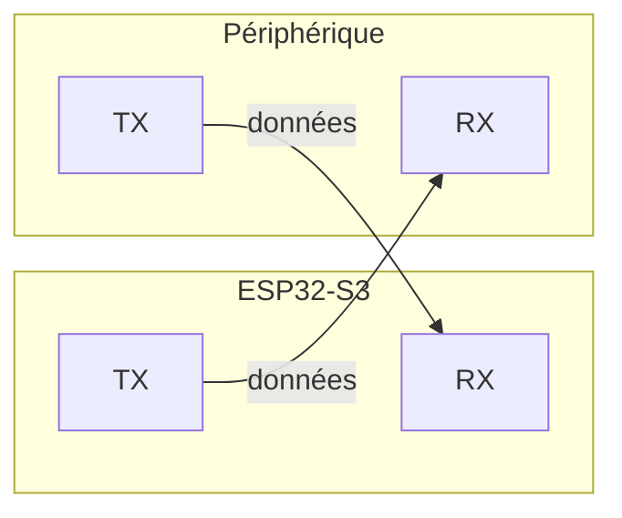
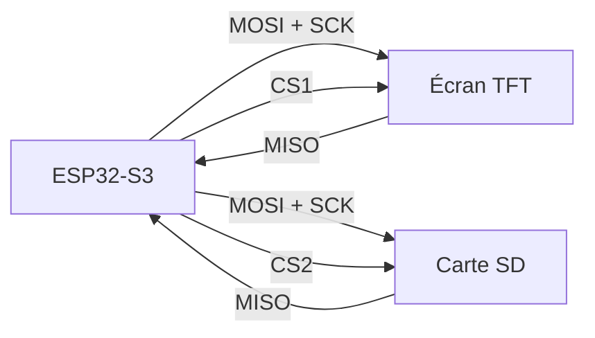
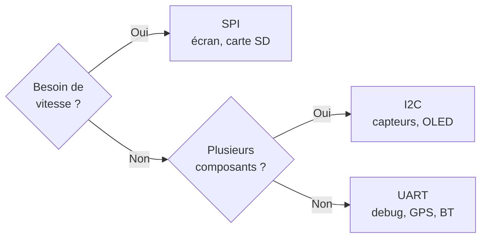
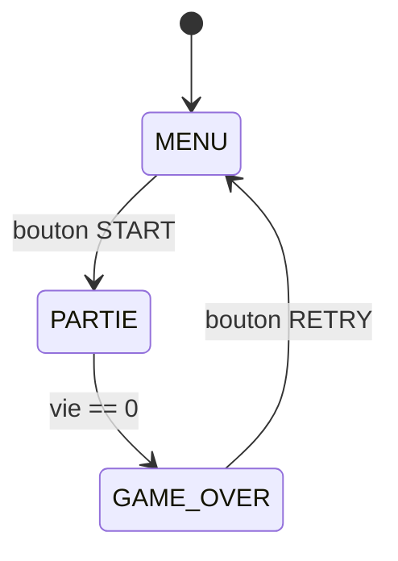
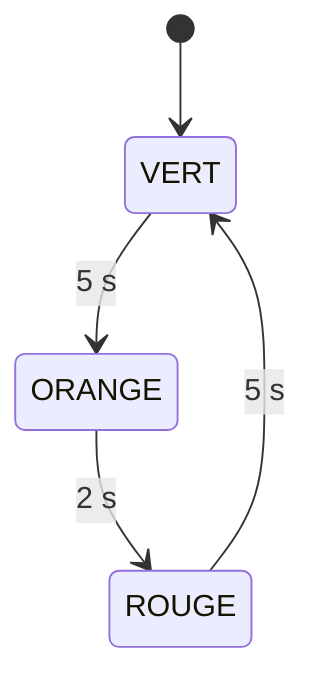

## Au programme

1. Pourquoi des bus
2. UART, I2C, SPI
3. Choisir son bus
4. La game loop
5. La machine à états

<aside class="notes" markdown="1">
1 h 30, dernier cours de la série. Garder du temps pour l'exercice de la FSM du Pong : une FSM se dessine sur papier, pas devant un écran.
Rappels d'ouverture : `millis()` du CM1, l'open-drain du CM2 (il revient avec l'I2C).
</aside>

---

## Ce que vous saurez faire

### À la fin de ce cours, vous saurez :

- dire pourquoi un **bus série** existe, et distinguer UART, I2C et SPI
- choisir le bus adapté à un périphérique, et le câbler correctement
- écrire une **game loop** qui ne bloque jamais
- reconnaître une situation où une **machine à états** s'impose
- l'implémenter avec un `enum` et un `switch`

Les deux premiers font dialoguer la puce avec le monde ; les trois derniers gardent votre code lisible.
{: .caption}

[Les bus de communication](/workshops/microcontroleur/concepts/bus-communication/){: .doc-link} [Machine à états finis](/workshops/microcontroleur/concepts/machine-etats-finis/){: .doc-link}

---

<!-- .slide: class="slide-section" -->

## Pourquoi des bus

Faire dialoguer les composants

---

## Un fil par information ?

Un écran couleur 240×240 reçoit **plus de 100 000 pixels par image**. Un capteur renvoie une température sur 16 bits. Une carte SD, des blocs de 512 octets.

Câbler un fil par bit serait impraticable : plus aucune broche disponible, une carte illisible, et des perturbations entre pistes.

Un **bus série** envoie les bits **les uns après les autres**, sur deux à quatre fils. On échange de la largeur contre du temps, et la puce est assez rapide pour que ça ne se voie pas.
{: .fragment .highlight-red}

[Les bus de communication](/workshops/microcontroleur/concepts/bus-communication/){: .doc-link}

---

## Trois bus, trois compromis

- {: .fragment} **UART** : le plus simple. Deux fils, un seul interlocuteur, pas d'horloge partagée
- {: .fragment} **I2C** : deux fils, plusieurs composants distingués par une **adresse**
- {: .fragment} **SPI** : quatre fils, une horloge, le plus rapide des trois

Aucun n'est meilleur dans l'absolu : chacun échange de la vitesse contre des fils, ou des fils contre de la complexité. Le choix se fait par le besoin.
{: .fragment .caption}

[Les bus de communication](/workshops/microcontroleur/concepts/bus-communication/){: .doc-link}

---

<!-- .slide: class="slide-section" -->

## UART

Deux fils, point à point

---

## Le plus simple des trois



Pas d'horloge partagée : c'est un bus **asynchrone**. La vitesse est fixée des deux côtés à l'avance, c'est le **baud rate**, en général 115 200 bauds.

[Les bus de communication](/workshops/microcontroleur/concepts/bus-communication/){: .doc-link}

---



[Les bus de communication](/workshops/microcontroleur/concepts/bus-communication/){: .doc-link}

---

## Anatomie d'une trame

Sans horloge partagée, comment le récepteur sait-il quand lire ? La ligne est au repos à `HIGH`, et chaque octet est encadré :

- un **bit de start** (passage à `LOW`) annonce le début
- les **bits de données**, du poids faible au poids fort
- un **bit de parité** facultatif, pour détecter une erreur
- un ou deux **bits de stop** (retour à `HIGH`)

D'où la notation **`8N1`**. Format ou vitesse qui diffèrent : c'est le charabia du moniteur série.
{: .fragment .caption}

[Les bus de communication](/workshops/microcontroleur/concepts/bus-communication/){: .doc-link}

---

## Une trame, en vrai

{: .img-md}

Les curseurs mesurent **103,6 µs** par bit, soit 9600 bauds. Copie d'écran : Haji akhundov, via [Wikimedia Commons](https://commons.wikimedia.org/wiki/File:RS232-UART_Oscilloscope_Screenshot.png), sous [CC BY-SA 3.0](https://creativecommons.org/licenses/by-sa/3.0/deed.fr).
{: .caption}

[Les bus de communication](/workshops/microcontroleur/concepts/bus-communication/){: .doc-link}

---

## Là où vous l'utilisez déjà

```cpp
Serial.begin(115200);                 // UART0, via l'USB
Serial.printf("x=%d y=%d\n", x, y);
```

Le moniteur série est un UART. C'est aussi le bus des modules GPS, Bluetooth ou GSM, et le moyen le plus simple de faire dialoguer deux microcontrôleurs.

Sur la carte, une puce USB-série (CP2102 ou CH340) fait la traduction entre l'UART de l'ESP32 et le port USB du PC. C'est elle qui a besoin d'un driver sous Windows.
{: .fragment .caption}

[Le port série sous VSCode](/docs/tutorials/electronics/vscode-port-serie/){: .doc-link} [Vérification de la toolchain](/workshops/microcontroleur/tutorials/toolchain-blink/){: .doc-link}

---

<!-- .slide: class="slide-section" -->

## I2C

Deux fils, plusieurs composants

---

## Un bus, des adresses

Deux fils partagés : **SDA** (données) et **SCL** (horloge). Chaque composant a une **adresse** sur 7 bits.

1. **Start** : le maître prend la main sur le bus
2. **Adresse + R/W** : il désigne le composant, lecture ou écriture
3. **ACK** : l'esclave répond ; un silence = personne à cette adresse
4. **Données** : les octets circulent, chacun confirmé par un ACK
5. **Stop** : le maître libère le bus

[Les bus de communication](/workshops/microcontroleur/concepts/bus-communication/){: .doc-link}

---

## Les pull-ups ne sont pas optionnelles

SDA et SCL sont en **open-drain**, comme au CM2 : les composants ne peuvent que tirer la ligne vers `LOW`, jamais vers `HIGH`. C'est précisément ce qui permet à plusieurs d'entre eux de partager le fil sans court-circuit.

Il faut donc deux résistances de **pull-up** (~4,7 kΩ) vers le 3,3 V. Sans elles, la ligne ne remonte jamais et **rien ne communique**.

La plupart des modules du commerce les intègrent déjà. Si vous en chaînez plusieurs, une seule paire suffit sur tout le bus : inutile de les cumuler.
{: .fragment .caption}

[Les bus de communication](/workshops/microcontroleur/concepts/bus-communication/){: .doc-link} [GPIO et monde numérique](/workshops/microcontroleur/concepts/gpio-monde-numerique/){: .doc-link}

---

## Qui est là ? Le scanner I2C

On ne connaît pas toujours l'adresse. On les balaie toutes :

```cpp
for (byte adr = 1; adr < 127; adr++) {
  Wire.beginTransmission(adr);
  if (Wire.endTransmission() == 0) {
    Serial.printf("Trouvé : 0x%02X\n", adr);
  }
}
```

Absent du scan ? Le problème est le câblage ou les pull-ups.
{: .fragment .highlight-red}

[Les bus de communication](/workshops/microcontroleur/concepts/bus-communication/){: .doc-link}

---

## Vitesses standard

| Mode | Vitesse |
|---|---|
| Standard | 100 kHz |
| Fast | 400 kHz |
| Fast+ | 1 MHz |
{: .table-dense}

Largement suffisant pour des capteurs ou un petit écran OLED monochrome. Bien trop lent pour un écran TFT couleur : à 400 kHz, une image de 240×240 pixels demanderait plus de deux secondes.
{: .fragment .highlight-red}

[Les bus de communication](/workshops/microcontroleur/concepts/bus-communication/){: .doc-link}

---

<!-- .slide: class="slide-section" -->

## SPI

Quatre fils, plein débit

---

## Le bus de l'écran

| Fil | Rôle |
|---|---|
| **MOSI** | Données du maître vers l'esclave |
| **MISO** | Données de l'esclave vers le maître |
| **SCK** | Horloge, générée par le maître |
| **CS** | *Chip Select* : un fil par esclave |
{: .table-dense}

Transmission **synchrone** (l'horloge cadence chaque bit, donc pas de baud rate à accorder) et **full-duplex** (les deux sens en même temps).

[Les bus de communication](/workshops/microcontroleur/concepts/bus-communication/){: .doc-link}

---

## Un maître, plusieurs esclaves



Les trois premiers fils sont partagés ; seul le **CS** distingue les esclaves. Un seul CS actif à la fois, les autres composants se mettent en haute impédance.

De quelques MHz à **80 MHz** sur ESP32-S3 : c'est ce qui rend un écran TFT fluide.
{: .fragment .caption}

[Les bus de communication](/workshops/microcontroleur/concepts/bus-communication/){: .doc-link}

---

## Le câblage de l'écran

| Signal | Broche | Rôle |
|---|---|---|
| CS | GPIO10 | Sélection de l'écran sur le bus |
| DC | GPIO11 | Bascule commande / donnée |
| RST | GPIO12 | Reset matériel de l'écran |
| SCLK | GPIO13 | Horloge SPI |
| MOSI | GPIO14 | Données CPU vers écran |
| BLK | GPIO15 ou 3,3 V | Rétroéclairage |
{: .table-dense}

**MISO n'est pas câblé** : un bus full-duplex utilisé en écriture seule.
{: .fragment .caption}

[Écran TFT SPI ST7789](/docs/references/hardware/ecran-tft-spi-st7789/){: .doc-link}

---

## En pratique, vous n'écrirez pas le SPI

```ini
lib_deps =
    bodmer/TFT_eSPI@^2.5.0
build_flags =
    -DUSER_SETUP_LOADED=1
    -include User_Setup.h
```

```cpp
TFT_eSPI tft = TFT_eSPI();
tft.init();
tft.fillScreen(TFT_BLACK);
```



[Écran SPI et game loop](/docs/tutorials/electronics/ecran-spi-game-loop/){: .doc-link}

---

<!-- .slide: class="slide-section" -->

## Choisir son bus

---

## Le tableau de bord

| Critère | UART | I2C | SPI |
|---|---|---|---|
| Fils | 2 | 2 | 4 et plus |
| Vitesse | ~1 Mbit/s | 100 k à 1 Mbit/s | 10 à 80 Mbit/s |
| Plusieurs composants | non | oui, par adresse | oui, un CS chacun |
| Full-duplex | non | non | oui |
| Horloge partagée | non | oui | oui |
| Complexité | faible | moyenne | moyenne |
| Usage type | debug, modules | capteurs, OLED | écrans, carte SD |
{: .table-dense}

[Les bus de communication](/workshops/microcontroleur/concepts/bus-communication/){: .doc-link}

---

## L'arbre de décision



Notre projet : **UART** pour le moniteur série, **SPI** pour l'écran. **↓** pour la page.
{: .fragment .caption}

[Les bus de communication](/workshops/microcontroleur/concepts/bus-communication/){: .doc-link}

<!-- .down -->

## Le concept en ligne

<iframe class="page-preview" data-src="/workshops/microcontroleur/concepts/bus-communication/#tableau-comparatif" title="Concept : les bus de communication"></iframe>

---

<!-- .slide: class="slide-section" -->

## La game loop

Ne jamais bloquer

---

## Lire, mettre à jour, redessiner

<pre><code class="language-cpp" data-trim data-line-numbers="1-2|5|6-7|8-10">
unsigned long dernierUpdate = 0;
const unsigned long INTERVALLE = 16;   // ~60 images par seconde

void loop() {
  unsigned long maintenant = millis();
  if (maintenant - dernierUpdate >= INTERVALLE) {
    dernierUpdate = maintenant;
    lireEntrees();
    mettreAJourJeu();
    redessiner();
  }
}
</code></pre>

Cette charpente ne changera plus : le Pong puis le Snake enrichiront ces trois fonctions.
{: .caption}

[Écran SPI et game loop](/docs/tutorials/electronics/ecran-spi-game-loop/){: .doc-link}

---

## Pourquoi 16 ms

<div class="columns" markdown="1">
<div markdown="1">

<p class="big-number">16 ms</p>

**par image**, soit 60 images par seconde. En dessous, l'œil voit saccader.

</div>
<div markdown="1">

<p class="big-number">4 M</p>

**cycles CPU disponibles** dans ces 16 ms, à 240 MHz. De quoi faire beaucoup.

</div>
</div>

Si une image prend plus de 16 ms à calculer, le jeu ralentit au lieu de sauter des images. Premier suspect en cas de lenteur : un `delay()` oublié, ou un redessin complet de l'écran au lieu des seules zones modifiées.
{: .caption}

[Écran SPI et game loop](/docs/tutorials/electronics/ecran-spi-game-loop/){: .doc-link}

---

<!-- .slide: class="slide-section" -->

## La machine à états

Sortir du plat de spaghettis

---

## Le code qui s'emmêle

Un jeu a plusieurs moments de vie : un menu d'accueil, une partie en cours, un écran de fin. Gérés à la main, ils donnent ceci :

```cpp
bool enPartie = false;
bool gameOver = false;
bool menuActif = true;
// et ça empire à chaque nouvelle phase
```

Que veut dire `enPartie && gameOver` ? Rien. Et pourtant rien ne l'empêche.
{: .fragment .highlight-red}

[Machine à états finis](/workshops/microcontroleur/concepts/machine-etats-finis/){: .doc-link}

---

## Une FSM, c'est trois choses

- un ensemble **fini d'états**, des **transitions**, un **seul état actif**



[Machine à états finis](/workshops/microcontroleur/concepts/machine-etats-finis/){: .doc-link}

---

## La même chose, en tableau

| État \ Événement | START | vie == 0 | RETRY |
|---|---|---|---|
| **MENU** | PARTIE | - | - |
| **PARTIE** | - | GAME_OVER | - |
| **GAME_OVER** | - | - | MENU |
{: .table-dense}

Une case « - » veut dire « événement ignoré dans cet état ». Le tableau se traduit ligne à ligne en `switch/case`, et révèle les cas oubliés.

Le dessiner avant de coder prend cinq minutes, et en fait gagner deux heures.
{: .fragment .caption}

[Machine à états finis](/workshops/microcontroleur/concepts/machine-etats-finis/){: .doc-link}

---

## `enum` et `switch`

```cpp
enum EtatJeu { MENU, PARTIE, GAME_OVER };
EtatJeu etat = MENU;                      // l'état courant, un seul

void loop() {
  lireEntrees();
  switch (etat) {
    // un case par état
  }
}
```

Un `enum` nomme les états, une variable retient celui qui est actif. Le `switch` fait le reste.
{: .caption}

[Machine à états finis](/workshops/microcontroleur/concepts/machine-etats-finis/){: .doc-link}

---

## Un `case` par état

<pre><code class="language-cpp" data-trim data-line-numbers="1-4|5-9|10-12">
case MENU:
  afficherMenu();
  if (boutonStart()) { initialiserPartie(); etat = PARTIE; }
  break;
case PARTIE:
  mettreAJourJeu();
  afficherJeu();
  if (vieJoueur == 0) etat = GAME_OVER;
  break;
case GAME_OVER:
  afficherGameOver();
  if (boutonRetry()) etat = MENU;
</code></pre>

Un seul état par `case` : ce qu'il affiche, et vers où il bascule.
{: .caption}

[Machine à états finis](/workshops/microcontroleur/concepts/machine-etats-finis/){: .doc-link}

---



[Machine à états finis](/workshops/microcontroleur/concepts/machine-etats-finis/){: .doc-link}

---

## Faire une chose une seule fois

Réinitialiser le score ou effacer l'écran ne doit pas se répéter 60 fois par seconde. On l'exécute **au moment de la transition**, pas dans le `case` :

```cpp
void allerVers(EtatJeu nouvel) {
  etat = nouvel;
  entreeEtat = millis();                        // date d'entrée
  if (nouvel == PARTIE)    initialiserPartie();
  if (nouvel == GAME_OVER) afficherGameOver();
}
```

C'est l'**action d'entrée** (*onEnter*). Toutes les transitions passent par là.
{: .caption}

[Machine à états finis](/workshops/microcontroleur/concepts/machine-etats-finis/){: .doc-link}

---

## Un état qui bascule tout seul

L'écran « GAME OVER » revient au menu après trois secondes, sans bloquer quoi que ce soit :

```cpp
case GAME_OVER:
  if (millis() - entreeEtat > 3000) {
    allerVers(MENU);
  }
  break;
```

FSM et `millis()` se combinent naturellement : c'est la **transition temporisée**. La date d'entrée dans l'état, mémorisée par `allerVers()`, sert de référence.
{: .fragment .caption}

[Machine à états finis](/workshops/microcontroleur/concepts/machine-etats-finis/){: .doc-link} [Du matériel au logiciel](/workshops/microcontroleur/concepts/du-materiel-au-logiciel/){: .doc-link}

---

## L'exemple canonique : le feu tricolore



Trois états, des transitions purement temporisées, aucun bouton.
{: .caption}

[Machine à états finis](/workshops/microcontroleur/concepts/machine-etats-finis/){: .doc-link}

---

## Le feu tricolore, en entier

```cpp
void loop() {
  unsigned long ec = millis() - entreeEtat;

  switch (etat) {
    case VERT:   if (ec > 5000) allerVers(ORANGE); break;
    case ORANGE: if (ec > 2000) allerVers(ROUGE);  break;
    case ROUGE:  if (ec > 5000) allerVers(VERT);   break;
  }
}
```

Aucun `delay()` : le programme pourrait aussi lire un bouton piéton.
{: .fragment .caption}

[Machine à états finis](/workshops/microcontroleur/concepts/machine-etats-finis/){: .doc-link}

---

## Ce que la FSM vous fait gagner

| Approche | Lisibilité | Extensibilité | Bugs typiques |
|---|---|---|---|
| Booléens | faible | difficile | états contradictoires |
| **FSM `enum`** | élevée | un `case` de plus | aucun |

Au projet, cette FSM s'étendra aux **états réseau** du Snake multijoueur.
{: .fragment .highlight-red}

[Machine à états finis](/workshops/microcontroleur/concepts/machine-etats-finis/){: .doc-link}

---

## Activité : la FSM de votre Pong

<p class="activity-meta"><span><i class="fas fa-user-friends"></i>En binôme</span><span><i class="far fa-clock"></i>10 min</span><span><i class="fas fa-pen"></i>Sur papier</span></p>

### Dessinez la machine à états de votre jeu

1. Quels sont les états ? (`MENU`, `PARTIE`, `PAUSE` ?, `GAME_OVER`)
2. Quels événements déclenchent chaque transition ?
3. Quel est l'état initial ?
4. Remplissez la table : y a-t-il des cases oubliées ?

Comparez avec le binôme voisin : les différences sont instructives.
{: .caption}

<aside class="notes" markdown="1">
Piège classique à relever pendant la mise en commun : oublier de réinitialiser le score en entrant dans PARTIE, ou permettre un RETRY pendant la partie. C'est exactement ce que la table de transitions révèle.
</aside>

[Machine à états finis](/workshops/microcontroleur/concepts/machine-etats-finis/){: .doc-link}

---

## À retenir

- {: .fragment} Un bus série envoie les bits l'un après l'autre
- {: .fragment} **UART** : 2 fils, croisement TX/RX, même baud des deux côtés
- {: .fragment} **I2C** : 2 fils, adressage, pull-ups ~4,7 kΩ obligatoires
- {: .fragment} **SPI** : 4 fils, un CS par esclave, le seul rapide pour un TFT
- {: .fragment} La game loop cadence à 16 ms avec `millis()`, sans jamais bloquer
- {: .fragment} Une FSM = états + transitions + un seul état actif
- {: .fragment .highlight-red} Action d'entrée à la transition, jamais dans le `case`

[Les bus de communication](/workshops/microcontroleur/concepts/bus-communication/){: .doc-link} [Machine à états finis](/workshops/microcontroleur/concepts/machine-etats-finis/){: .doc-link}

---

## Où tout cela vous mène

<p class="activity-meta"><span><i class="fas fa-rocket"></i>Le projet</span><span><i class="fas fa-user-friends"></i>En binôme</span></p>

- Un **Snake multijoueur** : la console d'un côté, un navigateur de l'autre
- Une mécanique neuve, les mêmes briques : GPIO, ADC, SPI, FSM
- La FSM **étendue aux états réseau** : connexion, attente, partie, déconnexion
- Un **PCB conçu sous KiCad** et soudé, pour remplacer la breadboard

Tout ce que vous venez de voir se retrouve là. Le projet n'ajoute que le réseau.
{: .fragment .caption}

[L'atelier Microcontrôleurs](/workshops/microcontroleur/){: .doc-link} [Collisions, score et machine à états](/workshops/microcontroleur/tutorials/collisions-fsm-pong/){: .doc-link}
